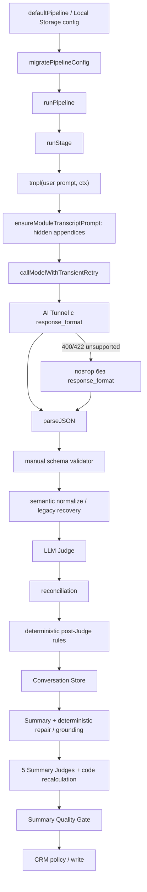

# Аудит runtime-контрактов пайплайна транскрибации и AI-саммари

Дата аудита: 2026-07-30

Репозиторий: `alexandrconsalt-tech/ai-product-studio`

Проверенный commit: `9c5c8bffe586fbfa74355211ac7e2789c4f00c9a` (`fix(pipeline): synchronize need agent contract`, 2026-07-29 16:39:41 +03:00)

Область: только продукт «Модуль транскрибации и AI-саммари звонков», runtime `public/pipeline-lab-v3.html` и его мост в MVP.

Изменения runtime, prompts, schemas, UI и deploy не выполнялись.

Если в ссылке на строки не указан иной файл, она относится к
`public/pipeline-lab-v3.html` — единственному активному standalone runtime
исследуемого пайплайна.

## Ограничение доказательной базы

Указанный исходный файл `pipeline_report - 2026-07-29T191541.436.json` отсутствует:

- в рабочем дереве;
- в `/Users/alexandr/.codex/attachments`;
- в `/Users/alexandr/Downloads`;
- в `/Users/alexandr/Documents`.

В Downloads присутствуют отчёты до `pipeline_report - 2026-07-29T153752.808.json`, но подмена исходного запуска соседним отчётом недопустима. Поэтому ниже:

- фактическая архитектура и причины поведения доказаны текущим кодом commit `9c5c8bf`;
- значения `unknown canonical funding_source`, `score=77`, `continue_pipeline=true`, `call_results[0]`, `repair_attempted=false` и прочие данные конкретного запуска считаются цитатами из постановки задачи, а не независимо проверенными полями исходного JSON;
- точный `resolved_prompt`, raw response, `pipeline_configuration_hash`, prompt hashes и полный набор входных facts конкретного запуска восстановить нельзя;
- точное числовое разложение `score=77` невозможно без отсутствующих `facts`, `fact_check.judge_items`, `criticalInput` и `stageReports`. Формула и функции расчёта установлены точно.

## Executive summary

Пайплайн падает не из-за одного prompt. В runtime одновременно существуют четыре независимых слоя управления контрактом:

1. сохраняемый пользователем stage prompt из Local Storage;
2. скрытые appendices, добавляемые после `tmpl(...)`;
3. transport-level JSON Schema, которая может быть молча снята после ответа AI Tunnel 400/422;
4. ручные JS validators, semantic normalizers, recovery и reconciliation, способные изменить или отменить ответ модели.

Корневые причины:

1. **Outcome Agent имеет parser-only контракт.** Runtime валидирует ответ как `outcome_v2`, но не создаёт для Outcome `response_format`; `response_schema_id=null`, `structured_output_requested=false`. Полная структура существует в пользовательском prompt и validator, но не является transport-level schema.
2. **Structured Output fallback меняет контракт запроса.** AI Tunnel сначала получает JSON Schema, а при 400/422 с текстом `unsupported` запрос автоматически повторяется без `response_format`. Критический этап продолжает работу через `parseJSON` и ручной validator.
3. **Need Judge имеет намеренно более широкое право, чем исходный пользовательский prompt из постановки.** Скрытый appendix и runtime entries разрешают менять `value` у `funding_source` и `purchase_term`. Значение `наличными` при этом не канонично и отклоняется validator.
4. **Need technical error специально объявлен продолжимым.** `needCheckTechnicalOutput` создаёт provisional-объекты с `verified:false`, `verification_status:"unverified_due_to_technical_error"` и `continue_pipeline:true`. Outcome dependency принимает такой результат, orchestrator не останавливается, а Quality Gate позже принудительно выдаёт `TECHNICAL_ERROR`.
5. **Fact Judge не является последним словом.** После verdict-only reconciliation `factCodeSemanticRejection` повторно отклоняет факты, а цитаты отклоняются вслед за потерей supporting facts. Блок `reconciliation` при этом описывает только LLM reconciliation до code rejection, поэтому может показывать `rejected_count:0` рядом с непустыми `rejected_facts`.
6. **Need Agent output семантически переписывается без полного deletion audit.** `normalizeNeedExtractionSemantics` фильтрует interests и requirements, пересчитывает meta, восстанавливает отдельные значения и дедуплицирует локации. Удаления через `.filter(...)` не записываются в `need_meta.transformations`; поэтому `transformations:[]` совместим с исчезновением элементов, а исходные ID не перенумеровываются.
7. **Существуют три несовместимые архитектуры контрактов.** Активный iframe-runtime — untyped JS; `src/features/mvp/summary-v2` содержит отдельный Zod pipeline `summary-store-v2`; `src/shared/prompts/seed-prompts.ts` содержит ещё более старые flat prompts и прямо сообщает, что синхронизируется с standalone runtime вручную.
8. **Отчётный boundary не валидируется.** `PipelineLabV3RunPayload.report` и `stageReports` имеют тип `unknown`, а type guard проверяет только два строковых поля сообщения. UI доверяет объекту из iframe.

Предыдущие точечные исправления не устранили класс проблемы, потому что меняли один слой, а runtime продолжал поддерживать Local Storage migrations, hidden appendices, parser-only schemas, deterministic overrides и legacy adapters как параллельные источники истины.

## Runtime architecture



Основной entry point — `runPipeline` (`public/pipeline-lab-v3.html:11261-11465`). Он последовательно вызывает `runStage`, сохраняет `rep.output` в общий `ctx`, после чего отдельным блоком вычисляет stop policy.

Активный runtime не импортируется из TypeScript. React только показывает `public/pipeline-lab-v3.html` в iframe (`src/features/mvp/screens/pipeline-lab-v3-screen.tsx:66-76`).

## Карта исполнения

| Этап | Entry point | Prompt resolver / hidden text | Response schema | Parser / validator | Repair / post-processing | Следующий этап |
|---|---|---|---|---|---|---|
| `facts` | `runStage` (`10926-11010`) | `tmpl` → `ensureModuleTranscriptPrompt` → `factExtractionContractAppendix` (`2645-2658`, `2710-2712`) | `facts_v2`, `FACT_EXTRACTION_JSON_SCHEMA` (`655-669`, `10981-10987`) | `parseJSON` → `recoverLegacyFactRootArray` → `applyFactExtractionPolicies` → `validateFactExtractionRoot` (`11001-11010`) | Retry unknown category; root-array recovery; policy filtering (`11014-11045`) | `fact_check` |
| `fact_check` | hybrid branch `runStage` (`10769-10901`) | user prompt + hidden «АКТИВНЫЙ КОНТРАКТ FACT JUDGE» (`2656-2658`) | `judge_fact_verdict_only_v2` (`10792-10799`) | `parseJSON` → `validateFactJudgeOutput` (`10802-10810`) | One schema repair; `reconcileVerdictOnly`; `factCodeSemanticRejection`; quote cascade (`10825-10849`, `9255-9309`) | `needs` |
| `needs` | generic model branch (`10927`, `10945-11114`) | user prompt + «ПРИОРИТЕТ ИСТОЧНИКОВ» + `needExtractionContractAppendix` (`2660-2663`, `727-783`) | `needs_v2`; contract version `needs_v2.1`; schema hash (`671-725`, `10985-10987`) | `parseJSON` → legacy interest recovery → `validateNeedExtractionRoot` (`11006-11010`) | One schema repair; `normalizeNeedExtractionSemantics` filters and restores fields (`9462-9611`) | `need_check` |
| `need_check` | hybrid branch (`10778-10899`) | user prompt + hidden «АКТИВНЫЙ КОНТРАКТ NEED JUDGE» (`2664-2665`) | `judge_need_verdict_only_v2` (`8759-8764`, `10792-10799`) | `parseJSON` → `validateNeedJudgeOutput` (`9772-...`, `10807`) | One Judge repair; `reconcileVerdictOnly`; recovery/dedupe; on error provisional output (`9884-9959`) | `outcome` when `continue_pipeline=true`, otherwise stop |
| `outcome` | generic model branch (`10928`, `10938-10943`) | user prompt + hidden «ОБЯЗАТЕЛЬНЫЙ КОНТРАКТ OUTCOME AGENT» (`2667-2668`) | **нет** (`responseFormat=null`, `10981-10987`) | `parseJSON` → `validateOutcomeExtractionRoot` (`10259-10320`) | Semantic normalizer runs only after shape validation; schema error repair explicitly skipped (`11027-11045`) | `outcome_check` |
| `outcome_check` | hybrid branch (`10779-10901`) | user prompt + hidden «АКТИВНЫЙ КОНТРАКТ OUTCOME JUDGE» (`2670-2671`) | `judge_outcome_verdict_only_v2` (`10001-10002`, `10792-10799`) | `parseJSON` → `validateOutcomeJudgeOutput` (`10562-10679`) | One Judge repair; reconciliation; legacy branch also applies semantic guards (`10686-10750`) | `conversation_store` |
| `conversation_store` | code dispatch → `buildConversationStoreV1` (`10903-10918`, `4712-4960`) | нет prompt | `conversation_store_v1` | manual invariants, hashes and references | filters only `verified/corrected`; recovers strict requirements/interest; builds business context; can accept continueable Need error | `summary` |
| `summary` | `runModuleSummaryStage` (`7502-7573`) | `moduleSummaryPrompt`; safe Store view | `module_summary_v1` (`6882-6890`, `7520-7522`) | `parseJSON` → deterministic repair → validator → store policy → grounding (`7523-7558`) | Retry; deterministic fallback; recovery; code can rewrite LLM result | 5 Judges |
| Truth Judge | `runModuleTruthCheckStage` (`7757-...`) | `moduleTruthPrompt` appends Summary, Store, transcript (`7752-7755`) | нет | `parseJSON` → `validateTruthJudgeOutput` | one repair; `truthGroundingIssues`; `truthRecalculate` fully recalculates flags/status/score (`7741-7750`) | Critical Completeness |
| Critical Completeness | `runModuleCriticalCompletenessStage` (`7994-...`) | prompt + closed `EXPECTED_CRITICAL_ITEMS` | нет | `parseJSON` → `validateCriticalCompletenessJudgeOutputV2` | one repair; code recalculates coverage/score | Agent Utility |
| Agent Utility | `runModuleAgentUtilityStage` (`8108-8119`) | prompt + Summary/Store context | нет | `parseJSON` → `validateAgentUtilityJudgeOutput` | one repair; `agentUtilityRecalculate` | Action |
| Action | `runModuleActionCheckStage` (`8242-8246`) | `moduleActionCheckPrompt` appends next step, verified outcome Store and transcript (`8241`) | нет | `parseJSON` → `validateActionCheckJudgeOutput` | one repair; `actionCheckCodeIssues`; `actionCheckRecalculate` (`8203-8239`) | Presentation |
| Presentation | `runModulePresentationCheckStage` (`8377-8381`) | prompt + Summary only (`8376`) | нет | `parseJSON` → `validatePresentationJudgeOutput` | one repair; deterministic prevalidation and full score recalculation (`8336-8374`) | Quality Gate |
| `summary_quality_gate` | `CODE_FUNCS.summaryQualityGate` → `moduleSummaryQualityGateV1` (`6035-6040`, `5106-5157`) | нет prompt | `summary_quality_gate_v1` | manual validator/aggregator | converts raw judge scores to 4-point scale, creates hard stops and policy | CRM |
| `crm` | `CODE_FUNCS.crm` → `moduleCrmV1` (`5359-...`) | нет prompt | `summary_v1` plus strict gate/store checks | `crmValidateInputs`, `crmValidateAttributes` (`5237-5295`) | idempotency, optimistic revision, retry only adapter errors | terminal |

### Может ли код изменить решение Judge

Да:

- Fact Judge: `factCodeSemanticRejection` and quote-support cascade (`9136-9153`, `9275-9288`).
- Need Judge: reconciliation применяет corrections; затем добавляет recovered requirements и dedupe (`9920-9959`).
- Outcome Judge: verdict-only corrections меняют accepted objects; legacy branch добавляет `outcomeSemanticGuards` (`10690-10722`).
- Все пять Summary Judges: LLM score/status/flags не считаются authoritative; runtime пересчитывает их (`7741-7750`, `7886-7983`, `8078-8102`, `8229-8239`, `8361-8374`).

## Contract matrix

### Активные определения

| ID / версия | Объявление | Подключение | Required / enums | Конфликт |
|---|---|---|---|---|
| `facts_v2` | `FACT_EXTRACTION_JSON_SCHEMA`, `655-669` | response format `10983-10985`; parser `validateFactExtractionRoot`, `8413-8487` | root `facts`, `quotes`, `extraction_meta`; category from `FACT_CATEGORY_VALUES`; speaker enum | Prompt example в сохранённом stage может отставать; hidden appendix добавляет список category. Schema допускает `normalized_value:null`, Store удаляет null. |
| `judge_fact_verdict_only_v2` | base `VERDICT_ONLY_JSON_SCHEMA`, `8721-8729` | `10792-10808` | каждый input ID ровно один раз; verdict `verified/rejected/needs_correction` | После Judge действует отдельный semantic reject; reconciliation counters этого не отражают. |
| `needs_v2` / `needs_v2.1` | constants/schema `671-725` | response, parser и prompt appendix `727-783`; runtime validator `9614-9693` | canonical interests, funding, term, 18 requirement types | ID схемы `needs_v2`, contract version `needs_v2.1`; parser-only aliases `area/floor/other` остаются в `NEED_REQUIREMENT_TYPES` (`681-683`). |
| `judge_need_verdict_only_v2` | `NEED_VERDICT_ONLY_JSON_SCHEMA`, `8759-8764` | `10792-10808` | funding/term value enum; source IDs; confidence | Hidden prompt и `needJudgeEntries` разрешают `value`, даже если пользовательский prompt из отчёта запрещал. |
| `outcome_v2` | **нет JSON Schema object**; контракт задан validator `10259-10320` и prompt `1030-1101` | parser_schema_id записывается в `11096`; response schema не создаётся | см. ниже | Parser-only contract: `response_schema_id=null`, `structured_output_requested=false`. |
| `judge_outcome_verdict_only_v2` | base verdict schema + result enum `10001-10002` | `10792-10808` | corrections зависят от kind (`10547-10552`) | Общая schema содержит больше полей, чем разрешает конкретный entry; окончательно ограничивает validator. |
| `conversation_store_v1` | manual builder `4712-4960` | code stage | verified/corrected only, no null, references/hashes/evidence | При continueable Need error Store создаётся без provisional needs, но с need score 0 и warning/manual status. |
| `module_summary_v1` | `6882-6890` | `7520-7527` | GENERATED, conversation_result, max 4 key facts, max 2 quotes, next_step, empty error | Runtime умеет fallback-generated output, поэтому LLM response не является единственным источником summary. |
| `summary_quality_gate_v1` | `4963-5012`, `5106-5157` | code stage | five equal weights; decisions AUTO_SAVE/SAVE_WITH_WARNING/REVIEW_REQUIRED/TECHNICAL_ERROR | Не общий legacy gate в `5950-6033`; выбор происходит через `shouldUseSummaryQualityGateV1`. |
| `summary_v1` CRM | `5160-5164`, `5237-5295` | `moduleCrmV1` | gate/store hashes, summary schema, canonical CRM enums | CRM boundary строже Store: attribute SAVE требует `verification_status="verified"` и confidence ≥ .95. |
| `transcription_summary_v1` | `1387` | migration stamps built-in stages `1710` | stage-level version, не schema version | Одинаковый contractVersion не гарантирует одинаковый prompt: `promptUserEdited` сохраняет override (`1683-1709`, `1774-1791`). |

### Полная активная схема Outcome Agent

Validator `validateOutcomeExtractionRoot` (`10259-10320`) требует:

```json
{
  "call_results": [
    {
      "id": "result_1",
      "value": "<OUTCOME_RESULT_VALUES>",
      "evidence": "<non-empty string>",
      "confidence": 0.0,
      "verification_status": "pending"
    }
  ],
  "agreements": [
    {
      "id": "agreement_1",
      "action": "<non-empty string>",
      "owner": "агент|клиент|оператор|оба",
      "recipient": "агент|клиент|оператор|оба|собственник|третье лицо|none",
      "deadline": "",
      "channel": "",
      "status": "confirmed|preliminary|promised|proposed|conditional",
      "evidence": "<non-empty string>",
      "confidence": 0.0,
      "verification_status": "pending"
    }
  ],
  "primary_next_step": {
    "action": "",
    "owner": "агент|клиент|оператор|оба|",
    "deadline": "",
    "channel": "",
    "status": "confirmed|preliminary|promised|not_defined",
    "agreement_ids": [],
    "confidence": 0.0,
    "verification_status": "pending"
  },
  "outcome_meta": {
    "result_count": 0,
    "agreement_count": 0,
    "decision": "EXTRACTED|NO_OUTCOME"
  }
}
```

`OUTCOME_RESULT_VALUES` объявлен в `10000`; остальные enums — `10003-10006`.

Схема присутствует в default user prompt (`public/pipeline-lab-v3.html:1030-1101`), но не передаётся провайдеру как JSON Schema: `responseFormat` создаётся только для Summary New, facts и needs (`10981-10987`). Поэтому поле отчёта `parser_schema_id:"outcome_v2"` при отсутствующем `response_schema_id` полностью соответствует текущему коду (`11091-11104`).

### TypeScript boundary

Активные Fact/Need/Outcome contracts не имеют TypeScript типов или Zod schemas: standalone runtime — plain JS. Это прямо записано в `src/shared/model/pipeline-lab-v3-message.ts:1-7`.

`PipelineLabV3RunPayload` типизирует только агрегаты; `report` и `stageReports` — `unknown` (`9-37`). `isPipelineLabV3RunMessage` проверяет только `source` и `type`, не структуру отчёта (`46-47`).

Отдельный `src/features/mvp/summary-v2/contracts.ts` имеет Zod contracts, но это другой product/runtime:

- project/product IDs — `contracts.ts:3-5`;
- `NextStepSchema` использует uppercase `CONFIRMED|CONDITIONAL|PROPOSED|NOT_DEFINED` и поле `responsible` (`28-35`);
- `CallOutcomeSchema` использует `VIEWING_SCHEDULED|...` (`37-41`);
- Store version — `summary-store-v2` (`113-139`).

Эти типы несовместимы с iframe `outcome_v2` и `conversation_store_v1`, но не участвуют в исследуемом report.

## Confirmed defects

### DEF-01 — Need Judge contract скрытно расширяет пользовательский prompt

- Severity: Critical
- Этап: `need_check`
- Файл/функция: `public/pipeline-lab-v3.html`, `ensureModuleTranscriptPrompt`, `needJudgeEntries`
- Строки: `2664-2665`, `9763-9769`
- Вход из постановки: Need Agent `funding_source.value="наличные / депозит"`.
- Ответ Judge: correction `value="наличными"`.
- Ожидание пользовательского prompt из постановки: corrections только `confidence/source_fact_ids/source_turn_ids`.
- Факт runtime: hidden appendix и `needJudgeEntries` разрешают `value` для `funding_source` и `purchase_term`.
- Влияние: модель получает более широкое право, чем видимый prompt; одинаковый пользовательский prompt имеет иной resolved contract.

Код:

```js
{id:'funding_source', ..., allowedCorrections:new Set(
  ['value','confidence','source_fact_ids','source_turn_ids']
)}
```

### DEF-02 — Каноническое значение может быть испорчено Judge, а validator превращает это в technical error

- Severity: Critical
- Этап: `need_check`
- Файл/функция: `validateNeedJudgeOutput`
- Строки: `9772-9778`
- Факт отчёта из постановки: correction `наличными`.
- Активный enum: `наличные / депозит` (`675`, `8759-8763`).
- Фактическое поведение: `наличными` вызывает `NeedJudgeSchemaError("unknown canonical funding_source")`.
- Почему исходно корректное значение меняется: hidden contract прямо предлагает Judge correction.value; запрета менять уже каноническое значение нет.
- Влияние: семантическое решение Judge становится schema failure всего этапа.

### DEF-03 — Repair не является нормализатором `наличными → наличные / депозит`

- Severity: High
- Этап: `need_check`
- Файл/функция: hybrid repair in `runStage`
- Строки: `10825-10849`
- Фактическое поведение: repair — второй LLM-вызов с текстом ошибки; код не применяет canonical alias normalization к correction.
- Поэтому повторный raw JSON может снова содержать `наличными`.
- По текущему commit `repair_attempted` должен стать `true` при любой `parseErr` (`10825-10826`, `10875`, `10891`). Указанное в постановке `repair_attempted:false` нельзя согласовать с текущим кодом без исходного `stageReports`: это доказывает либо иной deployed bundle/config path, либо то, что поле прочитано не из `contract_audit` этапа. Для выбора между ними нужен отсутствующий JSON и production asset hash.

### DEF-04 — `FAILED` и `continue_pipeline:true` описывают разные оси и одновременно допустимы

- Severity: Critical
- Этап: `need_check` / orchestrator
- Файл/функции: `needCheckTechnicalOutput`, `buildPipelineExecutionSummary`, `runPipeline`
- Строки: `9884-9893`, `11241-11258`, `11412-11430`
- Факт постановки: stage status FAILED при `continue_pipeline:true`.
- Фактическое поведение:
  - output получает `status:"technical_error"`, `execution_status:"TECHNICAL_ERROR"`, `decision:"ERROR"`;
  - `continue_pipeline:true` выставляется отдельно при наличии structurally usable input;
  - execution summary переводит любой `report.status` кроме `ok/warn/attn` в `FAILED`;
  - stop policy останавливает Need error только если `continue_pipeline!==true`.
- Влияние: отчёт честно говорит «этап failed», но orchestrator трактует его как non-blocking.

### DEF-05 — Provisional Need data допускает запуск Outcome

- Severity: Critical
- Этап: `need_check → outcome`
- Файл/функции: `needCheckTechnicalOutput`, `outcomeDependencyError`
- Строки: `9884-9893`, `10323-10329`
- Provisional objects: `verified:false`, `verification_status:"unverified_due_to_technical_error"`.
- `outcomeDependencyError` блокирует technical dependency только при `continue_pipeline!==true`.
- Следовательно Outcome запускается по дизайну текущего кода.
- Бизнес-оценка: Outcome не должен использовать provisional needs как verified facts. Текущий Outcome prompt получает весь `ctx`, поэтому технически эти данные доступны; отсутствие отдельного safe context contract делает запуск архитектурно небезопасным.

### DEF-06 — Conversation Store создаётся после technical Need error, но выкидывает provisional needs

- Severity: Critical
- Этап: `conversation_store`
- Файл/функция: `buildConversationStoreV1`
- Строки: `4712-4777`, `4950-4960`
- Store принимает technical dependency при `continue_pipeline:true` (`4717`).
- Затем predicate `verified` пропускает только `verified===true` и status `verified|corrected` (`4755-4777`), поэтому provisional objects не сохраняются.
- Need quality score при этом равен 0; Store становится `READY_WITH_WARNINGS` или `MANUAL_REVIEW`.
- Quality Gate отдельно обнаруживает `ctx.need_check.continue_pipeline===true` и выдаёт technical error (`5115`, `5139`).
- Влияние: downstream может генерировать Summary из неполного Store, но CRM auto-save будет заблокирован поздно.

### DEF-07 — Outcome Agent parser-only: schema известна runtime, но не модели на transport level

- Severity: Critical
- Этап: `outcome`
- Файл/функция: generic LLM branch `runStage`
- Строки: `10981-10987`, `11096`, `10259-10320`
- Факт постановки: `structured_output_requested:false`, `response_schema_id` отсутствует, `parser_schema_id:"outcome_v2"`.
- Код точно формирует такое сочетание.
- Влияние: модель свободно возвращает `call_results: string[]` и legacy objects; parser затем hard-fails.

### DEF-08 — Outcome schema error намеренно не repair-ится

- Severity: Critical
- Этап: `outcome`
- Файл/функция: `runStage`
- Строки: `11027-11045`
- Условие repair:

```js
parseErr && ... && (!(isFactsExtraction||isOutcomeExtraction)||parseErrKind!=='schema')
```

- Для Outcome + schema error выражение ложно.
- Поэтому `call_results[0]: expected object, received string` непосредственно даёт `repair_attempted:false`.
- Влияние: все downstream stages становятся NOT_RUN через `extractorTechnicalFailure` (`11412`, `11429-11439`).

### DEF-09 — Legacy Outcome fields не определены в активном repository contract

- Severity: High
- Этап: `outcome`
- Факт постановки: `{agreement_id,text,status:"agreed"}`, `primary_next_step.status:"defined"`.
- Repository search: активные prompts/validators не содержат enum `agreed` или `defined` и не принимают root agreement fields `agreement_id/text`.
- Активный validator требует `id/action/...` и rejected extras (`10017-10021`, `10279-10293`).
- В `src/shared/prompts/seed-prompts.ts:145-158` есть другой legacy flat Outcome prompt (`call_result`, `next_step`, `agreements:string[]`), но standalone runtime его не читает (`seed-prompts.ts:102-110`).
- Точное происхождение `agreed/defined` установить нельзя без `resolved_prompt`, raw response и сохранённого Local Storage из отсутствующего report. Кодовая база подтверждает только то, что эти значения не принадлежат текущему active contract.

### DEF-10 — Fact Judge verdict переопределяется кодом

- Severity: Critical
- Этап: `fact_check`
- Файл/функции: `mergeFactCheck`, `factCodeSemanticRejection`
- Строки: `9136-9153`, `9255-9309`
- Факт постановки: все 19 judge items `verified`, но final rejects `fact_1`, `fact_2`, `quote_1`.
- Путь:
  1. `reconcileVerdictOnly` считает LLM verified (`9265`);
  2. `factContextualConfirmation` применяется к facts (`9275`);
  3. `factCodeSemanticRejection` может удалить их (`9277-9284`);
  4. цитата, ссылающаяся на удалённый fact, переносится в rejected (`9285-9288`).
- `question_as_fact` срабатывает, если evidence заканчивается `?`, category не `client_question`, нет regex explicit intent и это не разрешённое agent commitment (`9144-9148`).
- Поэтому `client_intent` и `object_context` могут быть отклонены одинаковым правилом, несмотря на verified Judge.

### DEF-11 — Reconciliation counters не включают deterministic rejection

- Severity: High
- Этап: `fact_check` / UI
- Файл/функции: `mergeFactCheck`, `renderVerdictOnlyJudgePanel`
- Строки: `9289-9309`, `11637-11642`
- `reconciliation.verified_count/rejected_count` строятся из `reconciled`, то есть до `codeRejected`.
- Final `facts_verified/facts_rejected/quotes_rejected` строятся после code rules.
- UI показывает оба набора без явного указания разных фаз.
- Это точно объясняет сочетание `reconciliation.verified_count:19/rejected_count:0` и final rejects.

### DEF-12 — `corrected_items_count` может не совпадать с `corrected_items`

- Severity: High
- Этап: `facts → fact_check`
- Файл/функции: `applyFactExtractionPolicies` audit consumer in `mergeFactCheck`
- Строки: `9300-9305`
- `corrected_items` берётся из Judge reconciliation (`9309`).
- `corrected_items_count` берётся из `ctx.__extraction_audits.facts.corrected_fact_count` (`9300-9305`).
- Это разные фазы. Поэтому `corrected_items_count=1`, `corrected_items=[]`, `applied_corrections=[]` не противоречат текущему коду, но название поля вводит в заблуждение.

### DEF-13 — Формула Fact Check допускает score 77 после all-verified Judge

- Severity: High
- Этап: `fact_check`
- Файл/функция: `mergeFactCheck`
- Строки: `9289-9299`
- Формула:

```text
precision_score = final facts_verified / facts_checked
critical_recall_score = criticalVerified /
  (criticalInput.length + critical_facts_missing)
uncappedScore = (precision_score * 0.5 + critical_recall_score * 0.5) * 100
scoreCap = missing>=2 ? 60 : missing==1 ? 80 : 100
score = round(min(uncappedScore, scoreCap))
```

- Quote score не входит в итоговый verdict-only score.
- Точное получение 77 для проблемного запуска невозможно доказать без отсутствующих массивов facts и warnings. Код подтверждает, что deterministic rejects уменьшают `precision_score`, даже когда Judge verified все items.

### DEF-14 — Need semantic filter удаляет элементы без deletion audit

- Severity: Critical
- Этап: `needs`
- Файл/функция: `normalizeNeedExtractionSemantics`
- Строки: `9503-9508`, `9535-9554`, `9604-9611`
- Удаляются:
  - неподтверждённые canonical interests;
  - current object card;
  - readiness/viewing state;
  - price limit из question или availability;
  - почти все question-derived requirements;
  - любые non-location requirements без regex `хочу|ищу|нужн|важн|...`.
- В постановке первые три requirements (`market_type`, `property_type`, «отправить планировки») могли быть удалены именно predicate `clientConfirmed`/question/current-object, а «канал связи» сохранён, если source fact text попал под широкий `clientConfirmed` или `questionFacts.length>0`.
- Точный predicate каждого из четырёх элементов нельзя назвать без отсутствующих `source_fact_ids`, verified facts и evidence.
- Удаление не добавляет запись в `semanticTransformations`. `transformations` содержит только recover/merge operations (`9374`, `9523-9525`, `9602-9606`).
- IDs не перенумеровываются после `.filter`, поэтому единственный surviving item сохраняет `requirement_4`.

### DEF-15 — Local Storage и promptVersion не гарантируют единый prompt

- Severity: High
- Этап: конфигурация
- Файл/функции: `loadPipelineConfig`, `migratePipelineConfig`
- Строки: `1440-1454`, `1598-1804`
- Saved user config authoritative; migration сохраняет real user override (`1650-1652`, `1703-1709`, `1777`).
- Hidden appendices добавляются независимо от `promptVersion`.
- Поэтому два браузера с одинаковым `promptVersion` могут иметь разные user prompt bodies, `promptSource`, settings и resolved prompts.
- contractVersion `transcription_summary_v1` не hash всего resolved prompt.

### DEF-16 — Structured Output unsupported fallback допустим на критических этапах

- Severity: Critical
- Этап: transport
- Файл/функция: `callAiTunnel`
- Строки: `6680-6704`
- При 400/422, содержащем `response_format/json_schema/structured/unsupported`, runtime повторяет запрос с `null` format (`6691-6696`).
- Модель получает schema в первом запросе; во втором — только prompt text. Нет отдельного echo/attestation, доказывающего, что модель получила schema.
- Parser fallback считается valid, если `parseJSON` и manual validator проходят; warning записывается как `STRUCTURED_OUTPUT_UNSUPPORTED_PARSER_FALLBACK` (`11104`).
- Для hybrid Judges это также разрешено; transport rejection не является blocking сам по себе.

### DEF-17 — UI/report boundary не различает raw, reconciled и final semantics

- Severity: Medium
- Этап: UI/report
- Файл/функции: `renderVerdictOnlyJudgePanel`, `renderReport`, `reportRunToParent`
- Строки: `11637-11655`, `11657-11755`, `11472-11521`
- Judge table показывает `judge_items` и `reconciliation`; final JSON показывает post-processed output.
- Нет обязательной фазовой маркировки `LLM verdict → code override → final`.
- Full report сохраняется без schema validation в payload; parent type guard не проверяет report shape.

## Need Judge: полный путь данных

1. Need Agent вызывается после успешного Fact Check (`10929-10936`).
2. `tmpl(stage.prompt, ctx)` подставляет контекст.
3. `ensureModuleTranscriptPrompt` добавляет source priority и active contract (`2660-2665`).
4. AI Tunnel получает `needs_v2` response schema; при unsupported retry идёт без schema (`10985-10996`, `6684-6696`).
5. `parseJSON`.
6. `recoverLegacyNeedInterestStrings` допускает старый `interest:string[]` (`9423-9444`).
7. `validateNeedExtractionRoot` и `normalizeNeedExtractionSemantics` фильтруют/переписывают output (`9614-9693`).
8. `needCheckCode` формирует Judge input; `needJudgeBusinessInput` убирает transformations (`9696-9699`).
9. Need Judge получает hidden право исправлять funding/term value.
10. `validateNeedJudgeOutput` проверяет canonical enum (`9772-9778`).
11. При ошибке — второй LLM repair (`10825-10849`), без alias normalizer.
12. При повторной ошибке — `needCheckTechnicalOutput`: provisional values + `continue_pipeline:true` (`9884-9893`).
13. Orchestrator не останавливается (`11414`, `11429`).
14. `outcomeDependencyError` принимает dependency (`10323-10329`).
15. Conversation Store фильтрует provisional values как unverified (`4759-4777`).
16. Quality Gate принудительно фиксирует `NEED_JUDGE_TECHNICAL_ERROR` (`5115`).

## Fact Judge и post-processing

`question_as_fact` не приходит от Judge. Это deterministic result функции `factCodeSemanticRejection`.

Правило проверяет окончание evidence знаком вопроса, а не `fact.value` или contextual answer. Исключения узкие:

- category уже `client_question`;
- evidence содержит explicit intent regex;
- Agent commitment с глаголом отправки.

Поэтому `object_context` почти всегда не проходит исключения, если evidence — вопрос. `client_intent` пройдёт только если сам вопрос содержит один из regex markers. Это и есть функция, переопределяющая all-verified Judge.

Отчётная модель содержит две разные истины:

- `judge_items/reconciliation` — решение LLM и применённые Judge corrections;
- `verified_facts/rejected_facts/rejected_quotes/fact_check_quality` — результат после deterministic code.

Формально оба блока соответствуют коду, но без phase label воспринимаются как логическое противоречие.

## Post-processing Need Agent

Функция `normalizeNeedExtractionSemantics` выполняется внутри validator до сохранения stage output. Это не только validation:

- удаляет interests;
- выбирает/перезаписывает funding source;
- сбрасывает purchase term;
- удаляет requirements;
- восстанавливает price, minimum area, location, ИЖС;
- объединяет search locations;
- пересчитывает `need_meta`.

Причины удаления не сохраняются. Audit поддерживает только четыре transformation types:

```text
MERGE_OVERLAPPING_SEARCH_LOCATIONS
RECOVER_SEARCH_LOCATION_RANGE
RECOVER_FUNDING_SOURCE
RECOVER_LEGACY_INTEREST_STRING
```

Это объясняет `transformations:[]` при реальном удалении и сохранение ID `requirement_4`.

## Hidden instructions audit

| Блок | Где добавляется | Порядок | Приоритет |
|---|---|---|---|
| `АКТИВНЫЙ КОНТРАКТ FACT AGENT` | `factExtractionContractAppendix`, `2710-2712` | после `tmpl(user prompt)` | текст объявляет active contract |
| `АКТИВНЫЙ КОНТРАКТ FACT JUDGE ИМЕЕТ ПРИОРИТЕТ` | `ensureModuleTranscriptPrompt`, `2656-2658` | после user prompt | явный приоритет |
| `ПРИОРИТЕТ ИСТОЧНИКОВ NEED AGENT` | `2660-2662` | перед Need appendix | явный приоритет источников |
| `АКТИВНЫЙ КОНТРАКТ NEED AGENT needs_v2.1` | `needExtractionContractAppendix`, `727-783` | после source priority | явный приоритет |
| `АКТИВНЫЙ КОНТРАКТ NEED JUDGE ИМЕЕТ ПРИОРИТЕТ` | `2664-2665` | после user prompt | явный приоритет |
| `ОБЯЗАТЕЛЬНЫЙ КОНТРАКТ OUTCOME AGENT` | `2667-2668` | после user prompt | обязательный, но неполный shape |
| `АКТИВНЫЙ КОНТРАКТ OUTCOME JUDGE ИМЕЕТ ПРИОРИТЕТ` | `2670-2671` | после user prompt | явный приоритет |
| Summary source/final rules | `2677-2684` | после user prompt | «имеют приоритет над противоречащими правилами выше» |
| Full transcript fallback | `2695-2707` | последним | добавляется, если transcript probe не найден |

В интерфейсе stage editor показывает `stage.prompt`, но appendices строятся только во время запуска. Их можно увидеть в download report через `resolved_prompt`, но не как редактируемую часть prompt. `reportRunToParent` сохраняет полный stage report (`11476-11496`).

Legacy instructions существуют в:

- `legacyPrompt` properties default stages, которые `sanitize` удаляет из report/config (`12170`);
- Local Storage migration maps/hashes (`1598-1804`);
- `src/shared/prompts/seed-prompts.ts:102-110`, ручная независимая копия, не используемая iframe.

## Structured Output audit

Таблица ниже описывает текущий code path. Значения конкретного отсутствующего report подтверждены только там, где они процитированы в постановке.

| Этап | Requested | Applied | Response schema | Parser schema | Причина fallback / примечание |
|---|---:|---:|---|---|---|
| Fact Agent | true | зависит от AI Tunnel; в постановке true | `facts_v2` | `facts_v2` | при 400/422 transport повторяет без schema |
| Fact Judge | true | в постановке false | `judge_fact_verdict_only_v2` | то же | `STRUCTURED_OUTPUT_UNSUPPORTED_PARSER_FALLBACK` |
| Need Agent | true | в постановке false | `needs_v2` | `needs_v2` | тот же transport fallback |
| Need Judge | true | в постановке false | `judge_need_verdict_only_v2` | то же | тот же transport fallback |
| Outcome Agent | **false** | false | `null` | `outcome_v2` | schema вообще не создаётся |
| Outcome Judge | true | зависит от provider | `judge_outcome_verdict_only_v2` | то же | тот же transport fallback |
| Summary | true | зависит от provider | `module_summary_v1` | `module_summary_v1` | transport fallback возможен; затем repair/fallback |
| 5 Summary Judges | false | false | `null` | отдельные manual validators без schema ID в report | plain JSON prompt + parse + retry |

Один provider/model ведёт себя по-разному, потому что runtime передаёт разные `responseFormat`: отсутствие/наличие определяется stage code, а applied зависит от ответа transport на конкретную schema. AI Tunnel фактически получает OpenAI-compatible body с `response_format` (`6684-6688`). Проверки, что downstream model действительно применила schema, кроме отсутствия transport error и последующего manual validation, нет.

## Pipeline stop policy

### Фактические статусы

- `SUCCESS`, `SUCCESS_WITH_WARNING`, `FAILED`, `NOT_RUN` — derived report statuses в `buildPipelineExecutionSummary` (`11241-11258`).
- `TECHNICAL_ERROR` — общий pipeline status, если loop остановлен (`11247`).
- `continue_pipeline` — отдельный флаг только для continueable Need technical error (`9885-9893`).

### Blocking stages

`runPipeline` останавливается на (`11412-11430`):

- extraction `facts|needs|outcome` technical/dependency error;
- Fact Check technical error;
- Need Check technical error, только если `continue_pipeline!==true`;
- Outcome Check technical/dependency error;
- Conversation Store technical/dependency/source FAIL;
- Summary technical error;
- transcript validation FAIL;
- missing credentials или terminal provider failure.

Технические ошибки пяти Summary Judges не останавливают loop. Они должны дойти до Quality Gate, который выдаст `TECHNICAL_ERROR`.

### Ответы на вопросы остановки

1. Need Judge `FAILED + continue_pipeline:true`: разные оси, см. DEF-04.
2. Outcome запускается: `outcomeDependencyError` разрешает continueable dependency.
3. После Outcome schema error pipeline останавливается: extraction technical error всегда blocking.
4. Conversation Store из provisional данных создать можно, но provisional values не входят в verified layer.
5. Summary может запуститься после Need Judge error, если Store получил допустимый status; однако Quality Gate позже выдаст technical error.
6. Low quality отделяется от technical error:
   - low quality → valid checker outputs + low scale/hard stops → `REVIEW_REQUIRED`;
   - missing Store/Summary/check → technical error codes (`5107-5139`);
   - checker schema/status inconsistency → technical error;
   - provider/parse errors Summary Judges превращаются в checker `status:error`, затем technical gate;
   - extraction parse/schema error обычно останавливает pipeline раньше Gate.

## Legacy conflicts

| Артефакт | Текущий/legacy | Доказательство |
|---|---|---|
| `needs_v2.1` contract + `needs_v2` schema ID | текущий | `671-725` |
| requirement aliases `area/floor/other` | parser-only legacy | комментарий и Set `681-683` |
| legacy interest `string[]` | recovery | `9423-9444` |
| fact root array | recovery | `8488-8503`, вызов `11003` |
| `call_results:string[]` | не текущий, не восстановимый active parser | validator `10267-10276` |
| `agreement_id/text/agreed/defined` | не текущий contract; происхождение не доказано | отсутствуют в active prompt/enum; rejected exact keys |
| flat Outcome `call_result/next_step/agreements:string[]` | legacy seed prompt другого runtime | `src/shared/prompts/seed-prompts.ts:145-158` |
| `transcription_summary_v1` | текущий stage migration stamp, не field schema | `1387`, `1710` |
| `summary-store-v2` Zod | параллельный отдельный pipeline | `src/features/mvp/summary-v2/contracts.ts:113-139` |
| `other_requirement` | текущий allowed requirement type | `677` |
| `question_as_fact` | текущий deterministic Fact/Truth issue | `9144-9148`, `7580-7581` |
| `object_context` | текущий Fact category, но также используется Need current-object filter | `645`, `9538-9540` |
| `наличными` | распознаваемый semantic alias при extraction, но не canonical Judge correction | `9491` против `675`, `9776` |
| `search_location` | текущий Fact и Need type; имеет дополнительные semantic filters | `645`, `677`, `9551` |

## Root cause

Единая причинно-следственная модель:

1. Browser загружает saved stage config, который может содержать user override и legacy state.
2. Runtime маркирует stages одним `transcription_summary_v1`, но не хэширует единый resolved contract.
3. Во время запуска к prompt добавляются скрытые правила, иногда расширяющие разрешённые corrections.
4. Transport может снять JSON Schema и повторить запрос plain JSON.
5. Parser использует другую, более строгую manual schema; у Outcome она вообще не была response schema.
6. Repair policies различаются: Judge errors retry-ятся; Outcome schema errors — нет; Need correction aliases не нормализуются.
7. После parsing semantic code удаляет/добавляет/переписывает элементы.
8. После Judge deterministic code повторно меняет accepted/rejected sets.
9. Audit counters относятся к разным фазам, но UI показывает их как один результат.
10. Orchestrator имеет специальное исключение для Need technical error, позволяющее строить downstream из неполного Store.
11. Quality Gate обнаруживает техническую деградацию только в конце.

Именно поэтому prompt-only fixes не дают стабильности: prompt не контролирует transport fallback, parser, semantic normalization, post-Judge overrides, Store filtering и stop policy.

## Recommended remediation order

Без внесения исправлений на этом этапе:

1. **Получить и зафиксировать исходный report и deployed asset hash.** Без этого нельзя доказать точный score 77, repair flag и resolved legacy prompt.
2. **Удалить параллельные источники контракта для одного active runtime.** Убрать ручные копии schema из prompt appendices и parser-only Outcome contract после введения generated artifacts.
3. **Сделать один versioned contract registry источником:** JSON Schema → generated runtime validator → generated TypeScript type → prompt-visible schema → report schema ID/hash.
4. **Запретить silent Structured Output fallback для критических extraction/Judge stages** либо явно переводить stage в technical error; provider capability проверять до запуска.
5. **Унифицировать repair policy.** Все schema errors должны иметь одинаковую policy; alias normalization не должна зависеть от повторного LLM.
6. **Разделить validation и semantic transformation.** Validator не должен удалять business items. Transformations должны возвращать `before/after/reason/source`.
7. **Сделать Judge authoritative либо формально назвать второй этап Code Arbiter.** Final counters должны включать LLM verdict, code override и итог по отдельности.
8. **Удалить continueable technical Need path** либо передавать Outcome строго типизированный safe context без provisional needs и запрещать Summary/Store до успешной повторной оценки.
9. **Унифицировать Outcome schemas.** Удалить flat seed schema, parser-only aliases и несовместимые enum generations из области одного продукта.
10. **Типизировать iframe report boundary.** Добавить runtime schema validation полного `stageReports`, contract audit и phase counters.
11. **Покрыть contract tests:** prompt/schema/parser hash equality; unsupported transport; exact repair policy; deterministic override accounting; Local Storage migrations.
12. **Покрыть end-to-end реальными проблемными reports:** полный путь до CRM и негативные сценарии с Need Judge technical error, Outcome legacy shape, all-verified Fact Judge + code rejection.

## Проверяемые contract tests для следующего этапа

1. `funding_source="наличные / депозит"` + Judge correction `"наличными"` не может изменить canonical value или обрушить stage.
2. Outcome Agent request обязательно содержит `outcome_v2` JSON Schema; отсутствие support должно быть blocking и отчётным.
3. Любое удаление requirement создаёт transformation audit с ID и reason.
4. `reconciliation.final_rejected_count` равен фактическому `rejected_facts + rejected_quotes` либо явно разделён по фазам.
5. `continue_pipeline:true` не допускает Outcome/Store/Summary без явной degraded-mode contract.
6. Одинаковые `promptVersion + contractVersion + schemaHash` дают байт-в-байт одинаковый resolved contract.
7. Full report проходит Zod/JSON Schema validation до сохранения в Dashboard.

## Просмотренные файлы и артефакты

Файлы, непосредственно прочитанные или найденные поиском при построении
runtime-карты:

- `public/pipeline-lab-v3.html` — active prompts, hidden appendices, schemas,
  parsers, validators, repair, recovery, reconciliation, Store, Summary,
  Quality Gate, CRM, orchestrator, report и UI;
- `src/features/mvp/screens/pipeline-lab-v3-screen.tsx` — iframe entry point и
  parent bridge;
- `src/shared/model/pipeline-lab-v3-message.ts` — TypeScript boundary сообщения
  и типы `unknown`;
- `src/features/mvp/summary-v2/contracts.ts` — параллельные Zod-контракты
  `summary-store-v2`;
- `src/shared/prompts/seed-prompts.ts` — legacy flat prompts и предупреждение о
  ручной синхронизации со standalone runtime;
- `/Users/alexandr/.codex/attachments/6b84ba3a-ea71-491c-be12-480b94d4e180/pasted-text.txt`
  — постановка аудита и процитированные поля проблемного запуска;
- имена `pipeline_report*.json` в `/Users/alexandr/Downloads`,
  `/Users/alexandr/Documents`, рабочем дереве и каталоге attachments — проверка
  наличия точного исходного отчёта.

Пользовательские незавершённые изменения, уже находившиеся в рабочем дереве,
не редактировались и не включались в область аудита.

## Итоговая проверка аудита

- Код, prompts, schemas, UI и deploy не изменялись.
- Создан только этот документ.
- Все активные execution paths проверены в локальном commit `9c5c8bf`.
- Неустановленные факты явно перечислены в разделе «Ограничение доказательной базы»; предположения не выданы за доказанные причины конкретного запуска.
