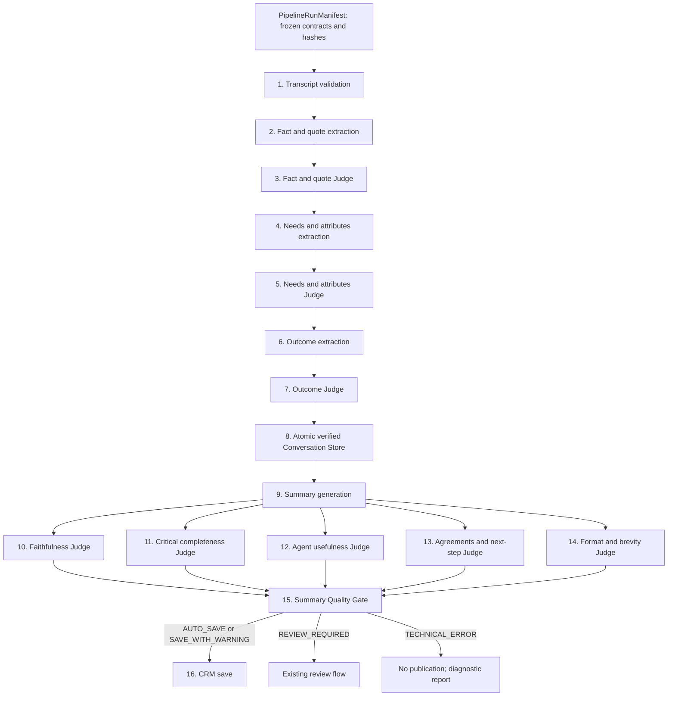
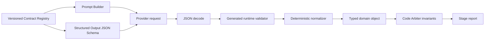

# Целевая архитектура пайплайна AI Summary v3

Дата проектирования: 2026-07-30

Продукт: «Модуль транскрибации и AI-саммари звонков»

Основание: `docs/transcription-summary-runtime-audit.md`, commit
`9c5c8bffe586fbfa74355211ac7e2789c4f00c9a`.

Статус: архитектурный проект, без реализации.

Область изменений этого этапа ограничена настоящим документом. Код, prompts,
schemas, конфигурация, UI, данные, production и deploy не изменяются.

## Executive summary

AI Summary v3 проектируется как следующая версия существующего пайплайна внутри
текущего Pipeline Lab, а не как новый продукт или независимый runtime. Текущий
интерфейс, история запусков, отчёты, формат Summary, пять критериев оценки и CRM
сохраняются. Меняется способ определения и исполнения контрактов.

Единственным источником истины становится Versioned Contract Registry. Для
каждого этапа одна JSON Schema порождает transport response schema, runtime
validator и TypeScript-типы. Prompt Builder получает тот же контракт и создаёт
полностью видимый `resolved_prompt`. Отдельная parser schema, hidden appendices,
ручные enum и Local Storage contract overrides запрещены.

Каждый run до первого этапа получает immutable `PipelineRunManifest`. Manifest
фиксирует версию pipeline definition, точные версии и hashes всех контрактов,
prompts, schemas, policies, provider capabilities и UI/report schema. Запуск
либо целиком исполняется по manifest, либо заканчивается технической ошибкой.

Все структурированные LLM-этапы используют Structured Output. Если провайдер не
поддерживает JSON Schema или отклоняет её, критический этап завершается
`TECHNICAL_ERROR`; повтор без `response_format` запрещён. Единственная repair-
попытка использует ту же модель контрактов и ту же JSON Schema.

Judge выполняет семантическую проверку, а Code Arbiter — только
детерминированные инварианты. Итог каждого элемента хранится как прозрачный
verdict trail. Conversation Store публикуется атомарно и содержит только
verified domain objects. Без опубликованного Store Summary и CRM не запускаются.

Миграция состоит из девяти фаз, Phase 0–8. Она выполняется внутри существующего
pipeline, за feature flag и с возможностью отката на предыдущую целую версию
между runs. Смешивание v2- и v3-контрактов внутри одного run запрещено.

## Architectural principles

Неподлежащие нарушению принципы:

1. **Один контракт — одна schema.** JSON Schema из Registry является transport,
   validation и type source одновременно.
2. **Immutable run manifest.** Все версии и hashes фиксируются до исполнения.
3. **Полная видимость prompt.** В отчёте хранится ровно тот `resolved_prompt`,
   который отправлен модели; hidden appendices отсутствуют.
4. **Fail closed для Structured Output.** Structured stage не деградирует в
   free-text режим.
5. **Validation не меняет данные.** Она только принимает или отклоняет объект.
6. **Normalization прозрачна.** Разрешены только versioned deterministic rules,
   и каждая трансформация входит в audit trail.
7. **Judge и Code Arbiter не дублируют ответственность.** Semantic verdict
   принадлежит Judge; технические инварианты — Arbiter.
8. **Verified-only Store.** Provisional, rejected и technical data не становятся
   рабочими фактами Summary.
9. **Technical error не является quality score.** Оценка качества существует
   только при пяти валидных verdicts.
10. **Один типизированный report boundary.** Iframe и основной интерфейс
    используют общий generated type и runtime validation.
11. **Нет silent compatibility.** Legacy input принимается только явной
    versioned migration до запуска v3.
12. **Наблюдаемость по умолчанию.** Любая коррекция, нормализация, дедупликация,
    миграция или rejection имеет формальную запись.
13. **Сохранение бизнеса.** V3 не меняет утверждённую семантику Summary, пять
    равновесных критериев и CRM policy без отдельного versioned решения.

## Current-to-target mapping

| Текущая подтверждённая проблема | Целевое решение |
|---|---|
| Local Storage prompt, hidden appendix, response schema и parser расходятся | Registry + Prompt Builder + immutable run manifest |
| `needs_v2` schema ID используется рядом с contract version `needs_v2.1` | Один ID `needs.agent.output.v3` с SemVer `3.0.0`; ID и version не подменяют друг друга |
| Outcome имеет parser-only `outcome_v2` | Одна `outcome.agent.output.v3` schema передаётся provider и validator |
| Structured Output снимается после 400/422 | Fail closed: `STRUCTURED_OUTPUT_UNAVAILABLE` или `SCHEMA_REJECTED` |
| Need Judge меняет canonical enum через hidden rule | Field-level correction policy из Registry запрещает semantic enum changes |
| Repair зависит от повторного свободного ответа LLM | Одна repair-попытка с той же JSON Schema; aliases обрабатывает deterministic normalizer |
| Fact Judge переопределяется скрытым semantic code | Judge semantic verdict финален; Arbiter проверяет только зарегистрированные инварианты |
| Need filters удаляют элементы без audit | Normalizer не удаляет бизнес-сущности; Judge rejection и dedupe записываются как операции |
| Technical Need error продолжает Outcome | Строгая blocking policy; Store не публикуется |
| Store строится из неполного контекста | Atomic verified-only Store с `publication_status` |
| UI смешивает LLM reconciliation и final result | Типизированный verdict trail с отдельными фазами |
| `report` и `stageReports` передаются как `unknown` | Общая `pipeline.report.v3` schema и generated types |
| Параллельные `conversation_store_v1` и `summary-store-v2` | Один `conversation.store.v3` для этого продукта и pipeline definition |

## Target pipeline diagram



Общий путь каждого структурированного LLM-этапа:



## Contract Registry

### Предлагаемая структура

```text
contracts/
  registry.ts
  pipeline/ai-summary-v3/
  transcript/
  facts/
  needs/
  outcome/
  conversation-store/
  summary/
  judges/
  quality-gate/
  crm/
  pipeline-report/
```

Каждая version directory содержит:

```text
<contract>/<version>/
  schema.json
  manifest.json
  normalization-rules.json
  migration-rules.json
  changelog.md
  fixtures/valid/
  fixtures/invalid/
```

Generated artifacts не редактируются вручную:

```text
generated/
  validators/
  types/
  schema-hashes.json
  contract-catalog.json
```

### Contract manifest

```json
{
  "schema_id": "needs.agent.output.v3",
  "contract_version": "3.0.0",
  "semantic_version": "3.0.0",
  "schema_sha256": "<canonical-json-hash>",
  "normalization_rules_version": "3.0.0",
  "migration_rules_version": "3.0.0",
  "compatibility": {
    "reads": ["needs.agent.output.v3@3.0.0"],
    "writes": "needs.agent.output.v3@3.0.0"
  },
  "typescript_type": "NeedsAgentOutputV3",
  "changelog_ref": "changelog.md"
}
```

`schema_id` обозначает назначение контракта, SemVer — его ревизию. Любое
изменение required fields, enums, nullable/optional semantics, normalization
rules или correction policy требует новой версии и changelog. Изменение
`schema.json` без обновления manifest блокирует build из-за hash mismatch.

### Активные контракты v3

| Назначение | Schema ID | Версия |
|---|---|---:|
| Pipeline definition | `pipeline.ai-summary.v3` | `3.0.0` |
| Transcript | `transcript.validated.v3` | `3.0.0` |
| Facts Agent output | `facts.agent.output.v3` | `3.0.0` |
| Fact verdict | `facts.judge.verdict.v3` | `3.0.0` |
| Verified facts | `facts.verified.v3` | `3.0.0` |
| Needs Agent output | `needs.agent.output.v3` | `3.0.0` |
| Need verdict | `needs.judge.verdict.v3` | `3.0.0` |
| Verified needs | `needs.verified.v3` | `3.0.0` |
| Outcome Agent output | `outcome.agent.output.v3` | `3.0.0` |
| Outcome verdict | `outcome.judge.verdict.v3` | `3.0.0` |
| Verified outcome | `outcome.verified.v3` | `3.0.0` |
| Conversation Store | `conversation.store.v3` | `3.1.0` |
| Summary Agent input | `summary.agent.input.v3` | `3.0.0` |
| Summary | `summary.content.v3` | `3.1.0` |
| Summary Judge input | `summary.judge.input.v3` | `3.0.0` |
| Shared Summary Judge verdict | `summary.judge.verdict.v3` | `3.1.0` |
| Quality Gate | `summary.quality-gate.v3` | `3.0.0` |
| CRM command/result | `crm.summary-write.v3` | `3.0.0` |
| Pipeline report | `pipeline.report.v3` | `3.0.0` |
| Audit operation | `pipeline.audit-operation.v3` | `3.0.0` |

### Выбор и фиксация версии

1. Published pipeline definition содержит точный список
   `schema_id@contract_version`, а не диапазоны.
2. Pipeline Lab выбирает published definition целиком. Пользователь не может
   заменить отдельный contract version.
3. До запуска Registry resolver проверяет hashes и формирует
   `PipelineRunManifest`.
4. Manifest сохраняется до первого provider request и становится частью report.
5. Все stages получают contract handle только из manifest.
6. Отчёт каждого stage повторяет ID, version и hash использованного контракта.
7. Run resume разрешён только с исходным manifest; подмена активной версии
   запрещена.

Так исключается одновременное использование `needs_v2` и `needs_v2.1`:
pipeline definition не может ссылаться на два write-контракта одного stage, а
Registry проверяет уникальность `(stage_id, output_role)`.

### Синхронизация артефактов

CI выполняет один generation pipeline:

```text
schema.json
  ├─ canonical schema hash
  ├─ provider response_format
  ├─ runtime validator
  ├─ TypeScript type
  ├─ UI field metadata
  └─ fixture tests
```

Prompt Builder получает schema projection из Registry, а не копию структуры.
UI может использовать только generated type и presentation metadata; он не
определяет enum. Contract tests сравнивают provider schema hash, validator hash,
type generation input и manifest hash. Любое расхождение блокирует merge.

### Nullable, optional и migrations

- Required означает обязательное наличие ключа.
- Nullable означает осмысленное `null`, явно разрешённое schema.
- Optional допускается только для transport/report metadata, но не вместо
  бизнес-состояния `not_defined`.
- Пустая строка не заменяет `null` или `not_defined`.
- Legacy migration — отдельная pure function
  `old validated object → new validated object + audit operations`.
- Migration выполняется только на сохранённых артефактах между runs. Raw LLM
  response не мигрируется и не используется как v3 business object.
- Непредставимое legacy-значение даёт migration rejection, а не догадку.

## Prompt Architecture

Prompt Builder имеет один публичный интерфейс:

```ts
buildResolvedPrompt({
  basePrompt,
  contractRef,
  canonicalDictionaries,
  inputContext,
  runtimeMetadata,
}): ResolvedPrompt
```

`ResolvedPrompt` состоит из трёх явно размеченных частей:

1. `business_instructions` — задача этапа, источники и запреты;
2. `technical_contract` — `schema_id`, `contract_version`, field descriptions,
   canonical dictionaries и correction policy из Registry;
3. `input_data` — валидированный контекст конкретного run.

Builder создаёт окончательный текст один раз. После сборки рассчитываются
`prompt_sha256` и `input_context_sha256`. Именно этот текст отправляется
provider и полностью сохраняется в stage report с безопасными ссылками на
чувствительные raw inputs.

Правила:

- hidden appendices и post-build string concatenation запрещены;
- system/business instructions хранятся как versioned prompt template;
- template ссылается на точный `schema_id@contract_version`;
- Local Storage хранит только разрешённые business wording/settings;
- пользовательский текст не может определять поля, enums, correction policy,
  stop policy или provider options;
- конфликт user text с technical contract отклоняется при сборке prompt;
- prompt version меняется при любом изменении business instructions;
- contract version меняется только через Registry;
- report хранит template version, resolved prompt, hashes и порядок сообщений;
- секреты и персональные данные могут храниться по content-addressed reference,
  но report обязан сохранять hash и точное представление отправленного payload.

## Structured Output

Structured Output обязателен для Fact Agent, Fact Judge, Need Agent, Need Judge,
Outcome Agent, Outcome Judge, Summary Agent и всех пяти Summary Judges.

| Ситуация | Поведение | Error code | Repair |
|---|---|---|---|
| Provider поддерживает schema | Запрос отправляется с JSON Schema из manifest | — | Не требуется |
| Capability отсутствует до запроса | Stage не вызывается | `STRUCTURED_OUTPUT_UNAVAILABLE` | Нет |
| Provider отклонил schema | Stage завершается technical error | `STRUCTURED_OUTPUT_SCHEMA_REJECTED` | Нет text fallback |
| Malformed JSON при активной schema | Сохраняется raw response; одна repair-попытка | `MALFORMED_JSON` при повторе | Та же schema |
| Schema mismatch | Сохраняются validation issues; одна repair-попытка | `SCHEMA_VALIDATION_FAILED` при повторе | Та же schema |
| Provider/network error | Применяется transport retry policy без изменения payload | `PROVIDER_ERROR` | Не schema repair |

Provider capability проверяется до run и фиксируется в manifest. Если разные
stages требуют разные schema features, проверяется superset. Transport retry
может повторить идентичный запрос при transient error, но не имеет права снять
`response_format`, заменить schema, модель или provider внутри stage.

Repair request содержит исходный raw response, machine-readable validation
issues и ту же JSON Schema. Максимум одна попытка. Repair response проходит
тот же decode и тот же generated validator. Успешный repair отмечается
`repaired=true`; исходный и исправленный raw response сохраняются раздельно.

## Parser and Validator

Отдельного business parser нет. Путь ответа:

```text
Provider bytes
→ UTF-8/JSON decode
→ generated validator по manifest schema
→ validated transport object
→ deterministic normalization
→ generated typed domain object
```

- Malformed JSON не анализируется regex и не извлекается из prose/code fences.
- Schema mismatch возвращает JSON Pointer, keyword, expected и actual type.
- Неизвестные поля отклоняются, если schema содержит
  `additionalProperties:false`.
- `string[]` не преобразуется в `object[]`.
- Отсутствующие business values не подставляются.
- Legacy fields не принимаются v3 validator.
- Частичное восстановление запрещено для stage output. При наличии независимых
  элементов Judge может отклонить отдельный валидный элемент, но transport
  object сначала обязан целиком пройти schema.
- Raw response разрешено повторно использовать только как вход единственной
  repair-попытки или как diagnostic artifact. Оно не становится domain object.

Stage report хранит raw response reference/hash, decode result, validation
issues, repair request/response references и окончательный validation status.

## Deterministic Normalization

Normalizer является pure function:

```ts
normalize<T>(
  validated: T,
  rules: NormalizationRuleSet,
): { value: T; operations: AuditOperation[] }
```

Допустимы:

- trim и унификация пробелов;
- зарегистрированная нормализация регистра;
- однозначный формат числа, даты или телефона;
- registered alias → один canonical enum;
- детерминированная дедупликация по versioned identity rule.

Запрещены:

- создание отсутствующего значения;
- semantic inference;
- замена одного canonical enum другим;
- удаление бизнес-сущности по смыслу;
- LLM-вызов;
- использование непроверенного контекста;
- изменение evidence или source IDs;
- скрытая коррекция решения Judge.

Пример versioned rule:

```json
{
  "rule_id": "funding_source.cash.alias_01",
  "contract": "needs.agent.output.v3@3.0.0",
  "field_path": "/structured_attributes/funding_source/value",
  "operation": "canonical_alias",
  "accepted_inputs": ["наличными", "наличные", "депозит"],
  "output": "наличные / депозит"
}
```

Каждое применение создаёт:

```json
{
  "operation_id": "op_...",
  "operation_type": "normalized",
  "field": "/structured_attributes/funding_source/value",
  "old_value": "наличными",
  "new_value": "наличные / депозит",
  "rule_id": "funding_source.cash.alias_01",
  "stage_id": "needs_extract",
  "reason": "registered canonical alias",
  "source": "contract-registry",
  "timestamp": "2026-07-30T00:00:00.000Z"
}
```

## Agent, Judge and Code Arbiter

### Ответственность

| Компонент | Делает | Не делает | Финальный authority |
|---|---|---|---|
| Agent | Извлекает кандидаты из разрешённого источника | Не принимает quality/stop decision | За `agent_output` |
| Judge | Семантически проверяет каждый candidate по transcript/evidence | Не меняет запрещённые поля и pipeline policy | За `judge_verdict` |
| Normalizer | Применяет заранее утверждённые технические rules | Не оценивает смысл | За `normalization_operations` |
| Code Arbiter | Проверяет IDs, references, enums, duplicates, source existence и contract invariants | Не повторяет semantic judgement | За `code_invariant_result` |
| Orchestrator | Применяет stop policy к stage result | Не переоценивает business content | За execution status |
| Quality Gate | Агрегирует пять валидных Summary verdicts | Не делает новую semantic проверку | За publication decision |

### Общий verdict contract

```ts
type JudgeVerdict = {
  item_id: string;
  verdict:
    | "verified"
    | "rejected"
    | "needs_correction"
    | "not_enough_evidence";
  reason_code: string;
  evidence_turn_ids: string[];
  confidence: number;
  corrections: Correction[];
};

type VerdictTrail<T> = {
  agent_output: T;
  normalization_operations: AuditOperation[];
  judge_verdict: JudgeVerdict;
  code_invariant_result: {
    status: "passed" | "failed";
    rule_results: InvariantResult[];
  };
  final_verdict: {
    status: "verified" | "rejected" | "technical_error";
    value: T | null;
    authority: "judge" | "code_arbiter";
  };
};
```

Correction policy задаётся для каждого field path в Registry. Общий baseline:
Judge может исправлять `confidence`, source IDs, точную формулировку и опечатку
без изменения смысла. Canonical business enum изменяется только в том
контракте, где конкретный field path явно разрешает такую коррекцию. Для
`funding_source`, `purchase_term` и статусов Outcome semantic enum correction
запрещён: Judge отклоняет candidate или возвращает `not_enough_evidence`.

Если invariant отменяет технически невозможный verified verdict, trail хранит
обе фазы, `authority:"code_arbiter"` и rule ID. Такой результат не отражается
как решение Judge и входит в итоговые counters отдельной колонкой.

## Domain contracts

### Facts and quotes

`facts.agent.output.v3`:

```ts
type FactCandidate = {
  id: string;
  kind:
    | "client_fact"
    | "property_fact"
    | "requirement_signal"
    | "client_question"
    | "conversation_context"
    | "unconfirmed_assumption";
  subject: "client" | "property" | "conversation";
  predicate: string;
  value: string;
  source_turn_ids: string[];
  evidence: string;
  confidence: number;
  verification_status: "pending";
};

type QuoteCandidate = {
  id: string;
  speaker: "client" | "agent" | "operator" | "other";
  text: string;
  source_turn_id: string;
  supports_fact_ids: string[];
  confidence: number;
  verification_status: "pending";
};
```

Обязательны `id`, discriminators, value/text, source references, exact evidence,
confidence и pending status. Evidence должен быть точной непрерывной выдержкой
из указанных turns. Quote text должен совпадать с transcript после допустимой
whitespace normalization.

Вопрос классифицируется как `client_question` и не подтверждает statement:
«Там переуступка?» не создаёт `property_fact=переуступка`. Подтверждение может
появиться только отдельным candidate с source turn, содержащим ответ.
`unconfirmed_assumption` хранится в Agent/Judge report, но не попадает в Store.

Дедупликация использует versioned identity key
`kind+subject+normalized(predicate)+normalized(value)+source_turn_ids`.
Она не сливает противоречащие facts. Judge отклоняет unsupported, role-mismatched
и question-as-statement candidates. Arbiter проверяет существование turn IDs,
exact evidence, уникальность IDs и отсутствие dangling quote references.

### Needs and structured attributes

`needs.agent.output.v3` разделяет пять коллекций:

```ts
type NeedsAgentOutputV3 = {
  business_needs: NeedCandidate[];
  property_requirements: PropertyRequirementCandidate[];
  structured_crm_attributes: StructuredAttributeCandidate[];
  communication_preferences: CommunicationPreferenceCandidate[];
  client_questions: ClientQuestionCandidate[];
};
```

Канал связи хранится только в `communication_preferences`, а вопрос — только в
`client_questions`. Они не являются property requirement.

Canonical dictionaries:

```text
interest[]:
  Новостройки | Ипотека | Строительство

funding_source:
  наличные / депозит
  ипотека одобрена
  ипотека в процессе
  продажа своей квартиры
  не определено

purchase_term:
  до 1 месяца
  2–3 месяца
  3–6 месяцев
  более 6 месяцев
  не определено
```

`interest` — множественный выбор только при прямом подтверждении. Funding и
purchase term — ровно одно значение; `не определено` является явным canonical
state, а не inference. Каждый candidate содержит `id`, typed value,
`source_fact_ids`, `source_turn_ids`, exact evidence, confidence и
`verification_status:"pending"`.

Косвенные признаки, вопросы клиента, слова агента и данные карточки не
подтверждают интерес, источник средств или срок. Judge может исправлять
confidence/source IDs и wording свободного requirement. Judge не меняет
canonical funding/term/interest value. Registered conversational aliases
нормализуются до Judge и отражаются в audit trail.

### Outcome

`outcome.agent.output.v3` имеет единственную структуру:

```ts
type OutcomeAgentOutputV3 = {
  call_result: {
    status:
      | "productive"
      | "no_result"
      | "follow_up_required"
      | "declined";
    description: string;
    source_turn_ids: string[];
    confidence: number;
  };
  agreements: Array<{
    id: string;
    action: string;
    owner: "agent" | "client" | "operator" | "both" | "third_party";
    recipient:
      | "agent"
      | "client"
      | "operator"
      | "both"
      | "owner"
      | "third_party"
      | "not_defined";
    deadline: string | null;
    channel: string | null;
    status:
      | "proposed"
      | "agreed"
      | "promised"
      | "completed"
      | "declined"
      | "not_defined";
    source_turn_ids: string[];
    confidence: number;
  }>;
  primary_next_step: {
    agreement_id: string | null;
    action: string | null;
    owner:
      | "agent"
      | "client"
      | "operator"
      | "both"
      | "third_party"
      | "not_defined";
    recipient:
      | "agent"
      | "client"
      | "operator"
      | "both"
      | "owner"
      | "third_party"
      | "not_defined";
    deadline: string | null;
    channel: string | null;
    status:
      | "proposed"
      | "agreed"
      | "promised"
      | "completed"
      | "declined"
      | "not_defined";
    source_turn_ids: string[];
    confidence: number;
  };
  unresolved_questions: Array<{
    id: string;
    question: string;
    asked_by: "client" | "agent" | "operator";
    assigned_to:
      | "agent"
      | "client"
      | "operator"
      | "third_party"
      | "not_defined";
    source_turn_ids: string[];
  }>;
};
```

`communication_channel`, `deadline` и `responsible_party` представлены
однозначными fields `channel`, `deadline`, `owner/recipient`. `not_defined`
используется только когда значение не прозвучало. Пустой `agreements` и
`primary_next_step.status="not_defined"` являются валидным бизнес-результатом.

Legacy `{agreement_id,text,status:"agreed"}` не проходит v3 schema. Его можно
преобразовать только заранее зарегистрированной migration из конкретной
валидированной legacy-версии; migration обязана заполнить audit operations или
отклонить непредставимое значение.

### Conversation Store

`conversation.store.v3` — immutable verified projection:

```ts
type ConversationStoreV3 = {
  store_id: string;
  run_id: string;
  schema_id: "conversation.store.v3";
  contract_version: "3.1.0";
  publication_status: "published";
  transcript_ref: { id: string; sha256: string };
  verified_facts: VerifiedFact[];
  verified_quotes: VerifiedQuote[];
  verified_needs: VerifiedNeed[];
  verified_structured_attributes: VerifiedAttribute[];
  verified_outcome: VerifiedOutcome;
  verified_agreements: VerifiedAgreement[];
  verified_next_step: VerifiedNextStep;
  unresolved_questions: VerifiedUnresolvedQuestion[];
  source_index: Record<string, SourceReference>;
  content_sha256: string;
  created_at: string;
};
```

Store не содержит raw errors, rejected/provisional candidates, prompts, Judge
reasoning, UI metadata или compatibility fields. Они остаются в Pipeline
Report. Builder принимает только `final_verdict.status="verified"` и проверяет
source graph. Любая technical error stages 1–7 запрещает публикацию Store.
Сборка атомарна: существует либо полностью validated `published` Store, либо
только failed stage report; incomplete Store не получает domain ID и не
доступен Summary.

### Summary and CRM attributes

`summary.content.v3`:

```ts
type SummaryContentV3 = {
  conversationResult: string;
  keyFacts: string[]; // 0..4
  importantQuotes: Array<{ text: string; sourceTurnIds: string[] }>; // 0..2
  agreementNextStep: string | null;
  structuredAttributes: {
    interests: CanonicalInterest[];
    fundingSource: CanonicalFundingSource;
    purchaseTerm: CanonicalPurchaseTerm;
  };
  metadata: {
    sourceStoreId: string;
    sourceStoreHash: string;
    contractVersion: "3.1.0";
    promptVersion: string;
  };
};
```

Summary Agent получает Conversation Store как единственный источник фактов.
Transcript доступен read-only только для проверки буквальной цитаты и языкового
контекста; он не может породить новый факт, отсутствующий в Store.

Business rules:

- краткий деловой текст без покадрового пересказа;
- не более 3–4 ключевых фактов;
- не более 1–2 значимых цитат;
- договорённость и следующий шаг — одно предложение;
- данные карточки объекта не дублируются без необходимости;
- confidence, IDs, verification statuses и технические атрибуты не выводятся;
- отсутствующая договорённость не выдумывается.

`summary.content.v3` отделён от
`crm.summary-attributes.v3`. CRM attributes строятся deterministic mapping из
`verified_structured_attributes`, а не извлекаются из текста Summary. Наличие
атрибута не означает, что он автоматически включён в readable Summary.

### Five Summary Judges

Все Judges возвращают `summary.judge.verdict.v3`:

```ts
type SummaryJudgeVerdictV3 = {
  criterion:
    | "faithfulness"
    | "completeness"
    | "usefulness"
    | "agreements_next_step"
    | "format";
  verdict: "pass" | "warning" | "fail" | "technical_error";
  score: 0 | 25 | 50 | 75 | 100 | null;
  confidence: number | null;
  issues: Array<{
    code: string;
    severity: "low" | "medium" | "high" | "critical";
    message: string;
    summaryFragment?: string;
    sourceTurnIds?: string[];
    storeItemIds?: string[];
  }>;
  evidence: Array<{
    statement: string;
    sourceTurnIds?: string[];
    storeItemIds?: string[];
  }>;
  payload: CriterionSpecificPayload;
  metadata: {
    sourceStoreId: string;
    sourceStoreHash: string;
    sourceSummaryHash: string;
    contractVersion: "3.1.0";
    promptVersion: string;
  };
};
```

Критерии имеют равный вес:

| Criterion | Вес | Проверяет |
|---|---:|---|
| `faithfulness` | 20% | выдуманные/искажённые факты, роли, точность цитат |
| `completeness` | 20% | цель, требования, ограничение/возражение, результат, следующий шаг |
| `usefulness` | 20% | достаточно ли Summary для продолжения работы без записи |
| `agreements_next_step` | 20% | кто, что, кому, когда и по какому каналу — только если было в разговоре |
| `format` | 20% | повторы, лишние данные карточки, ясность, краткость, scanability |

Judge получает typed `summary.judge.input.v3@3.0.0`: Summary, полный published
Store и точный transcript context. Пять полностью видимых prompt изолированы
по criterion. Code Arbiter проверяет дискретный score, verdict relation,
hashes, source refs, issue codes и payload, но не пересчитывает семантическую
оценку. Один technical error не останавливает остальные Judge calls.

### Summary Quality Gate

Quality Gate — deterministic aggregator, а не шестой Judge:

```text
quality_score =
  faithfulness * 0.20 +
  completeness * 0.20 +
  usefulness * 0.20 +
  agreements_next_step * 0.20 +
  format * 0.20
```

Score вычисляется только если пять verdicts валидны и ни один критический
upstream stage не имеет technical error. Thresholds и hard-stop codes хранятся
в `summary.quality-gate.v3@3.0.0`; начальная версия переносит отдельно
утверждённые текущие business thresholds без скрытого изменения.

Решения:

- `AUTO_SAVE` — score и hard-stop policy разрешают автоматическое сохранение;
- `SAVE_WITH_WARNING` — качество допустимо, есть только разрешённые warnings;
- `REVIEW_REQUIRED` — бизнес-качество ниже policy или отсутствует критический
  факт при технически корректном pipeline;
- `TECHNICAL_ERROR` — provider/schema/parse error Judge, incomplete Store или
  любая critical technical failure; `quality_score=null`.

CRM command создаётся только для `AUTO_SAVE` и `SAVE_WITH_WARNING`.
`REVIEW_REQUIRED` направляется в существующий review flow без автоматического
сохранения. `TECHNICAL_ERROR` запрещает публикацию и CRM write.

## Stage specifications

Общие правила для всех stages:

- input и output валидируются по exact contracts из run manifest;
- `SUCCESS_WITH_WARNING` допустим только для business warning, не для schema,
  provider или parse degradation;
- все LLM outputs structured;
- следующий stage получает только final typed output, но не raw response,
  reasoning или rejected candidates;
- stage report сохраняется независимо от успеха.

### Exact stage contract bindings

| № | Stage ID | Input contracts | Output contract |
|---:|---|---|---|
| 1 | `transcript_validate` | `transcript.raw.v3@3.0.0` | `transcript.validated.v3@3.0.0` |
| 2 | `facts_extract` | `transcript.validated.v3@3.0.0` | `facts.agent.output.v3@3.0.0` |
| 3 | `facts_judge` | `facts.agent.output.v3@3.0.0`, `transcript.validated.v3@3.0.0` | `facts.verified.v3@3.0.0` через `facts.judge.verdict.v3@3.0.0` |
| 4 | `needs_extract` | `facts.verified.v3@3.0.0`, `transcript.validated.v3@3.0.0` | `needs.agent.output.v3@3.0.0` |
| 5 | `needs_judge` | `needs.agent.output.v3@3.0.0`, `facts.verified.v3@3.0.0`, transcript | `needs.verified.v3@3.0.0` через `needs.judge.verdict.v3@3.0.0` |
| 6 | `outcome_extract` | verified facts/needs + transcript | `outcome.agent.output.v3@3.0.0` |
| 7 | `outcome_judge` | `outcome.agent.output.v3@3.0.0`, transcript | `outcome.verified.v3@3.0.0` через `outcome.judge.verdict.v3@3.0.0` |
| 8 | `conversation_store_build` | three verified domain outputs + transcript ref | `conversation.store.v3@3.1.0` |
| 9 | `summary_generate` | `summary.agent.input.v3@3.0.0` из `conversation.store.v3@3.1.0` и transcript projection | `summary.content.v3@3.1.0` |
| 10 | `summary_faithfulness` | `summary.judge.input.v3@3.0.0`, criterion `faithfulness` | `summary.judge.verdict.v3@3.1.0` |
| 11 | `summary_completeness` | `summary.judge.input.v3@3.0.0`, criterion `completeness` | `summary.judge.verdict.v3@3.1.0` |
| 12 | `summary_usefulness` | `summary.judge.input.v3@3.0.0`, criterion `usefulness` | `summary.judge.verdict.v3@3.1.0` |
| 13 | `summary_agreements_next_step` | `summary.judge.input.v3@3.0.0`, criterion `agreements_next_step` | `summary.judge.verdict.v3@3.1.0` |
| 14 | `summary_format` | `summary.judge.input.v3@3.0.0`, criterion `format` | `summary.judge.verdict.v3@3.1.0` |
| 15 | `summary_quality_gate` | five Judge verdicts + Store/Summary hashes | `summary.quality-gate.v3@3.0.0` |
| 16 | `crm_save` | Gate + Summary + `crm.summary-attributes.v3@3.0.0` | `crm.summary-write.v3@3.0.0` |

Сокращения `transcript`, `facts`, `needs`, `outcome`, `Store` и `Summary` в
следующих таблицах всегда означают exact bindings выше, зафиксированные run
manifest.

### Stages 1–8: verified domain layer

| № / Stage | Input → output contract | Исполнитель | Успех / technical error | Продолжение и доступ следующего stage | Final authority |
|---|---|---|---|---|---|
| 1. `transcript_validate` | `transcript.raw.v3` → `transcript.validated.v3@3.0.0` | deterministic | Success: непустые ordered turns, valid roles/IDs/timestamps. Technical: decode, empty transcript, invalid graph | При error stop; иначе полный validated transcript | Code Arbiter |
| 2. `facts_extract` | validated transcript → `facts.agent.output.v3@3.0.0` | LLM Agent + normalizer | Success: Structured Output validated, sources exist. Technical: provider, decode/schema после repair | При error stop; далее candidates + transcript | Agent за extraction, Arbiter за integrity |
| 3. `facts_judge` | fact candidates + transcript → `facts.verified.v3@3.0.0` | LLM Judge + Arbiter | Success: verdict для каждого ID, valid source graph. Business rejection допустим. Technical: missing verdict, provider/schema/invariant failure | При error stop; далее только verified facts/quotes | Judge semantic, Arbiter invariants |
| 4. `needs_extract` | verified facts + transcript → `needs.agent.output.v3@3.0.0` | LLM Agent + normalizer | Success: пять typed collections, canonical enums. Technical: Structured Output/validation failure | При error stop; далее candidates, verified facts и transcript | Agent/Normalizer |
| 5. `needs_judge` | need candidates + verified facts + transcript → `needs.verified.v3@3.0.0` | LLM Judge + Arbiter | Success: каждый candidate имеет verdict; `не определено` допустимо. Technical: provider/schema/invariant failure | При error stop; provisional output не публикуется; далее verified needs only | Judge semantic, Arbiter invariants |
| 6. `outcome_extract` | verified facts/needs + transcript → `outcome.agent.output.v3@3.0.0` | LLM Agent + normalizer | Success: call result, agreements, next step, unresolved questions valid; пустые agreements допустимы. Technical: provider/schema failure | При error stop; далее verified upstream + candidates | Agent/Normalizer |
| 7. `outcome_judge` | outcome candidates + transcript → `outcome.verified.v3@3.0.0` | LLM Judge + Arbiter | Success: semantic verdicts и valid references. Business rejection/`not_defined` допустимы. Technical: provider/schema/invariant failure | При error stop; далее только verified result | Judge semantic, Arbiter invariants |
| 8. `conversation_store_build` | три verified outputs + transcript ref → `conversation.store.v3@3.1.0` | deterministic | Success: complete source graph, canonical values, atomic hash. Technical: missing input, invariant/hash failure | При error stop; иначе только published Store доступен Summary | Store Builder/Arbiter |

Stage report 1–8 хранит input/output refs и hashes, contract metadata,
resolved prompt для LLM stages, provider details, Structured Output status, raw
response refs, validation, normalization operations, verdict trails, errors,
blocking flag и duration.

### Stages 9–16: Summary, evaluation and publication

| № / Stage | Input → output contract | Исполнитель | Успех / technical error | Продолжение и доступ следующего stage | Final authority |
|---|---|---|---|---|---|
| 9. `summary_generate` | `summary.agent.input.v3@3.0.0` → `summary.content.v3@3.1.0` | LLM Agent | Success: format limits, Store grounding refs, Structured Output valid. Technical: provider/schema/grounding invariant failure | При error все Judges `NOT_RUN`; иначе Phase 6 | Agent semantic, Arbiter grounding |
| 10. `summary_faithfulness` | typed Judge input → criterion-specific verdict | LLM Judge | Success: valid discrete verdict. Technical: provider/schema/ref failure | Остальные Judges продолжают независимо | Judge semantic, Arbiter formal invariants |
| 11. `summary_completeness` | typed Judge input → criterion-specific verdict | LLM Judge | Missing critical item — business finding, не technical error | То же | Judge semantic, Arbiter formal invariants |
| 12. `summary_usefulness` | typed Judge input → criterion-specific verdict | LLM Judge | Success или criterion-local technical error | То же | Judge semantic, Arbiter formal invariants |
| 13. `summary_agreements_next_step` | typed Judge input → criterion-specific verdict | LLM Judge | Не требует отсутствовавших deadline/channel | То же | Judge semantic, Arbiter formal invariants |
| 14. `summary_format` | typed Judge input → criterion-specific verdict | LLM Judge | Semantic repetition оценивает Judge, не код | После stage остановка Phase 6; Gate/CRM `NOT_RUN` | Judge semantic, Arbiter formal invariants |
| 15. `summary_quality_gate` | пять verdicts + Store/Summary hashes → `summary.quality-gate.v3@3.0.0` | deterministic | Success: пять valid verdicts. Technical: любой missing/technical verdict, hash mismatch, incomplete Store | `AUTO_SAVE/SAVE_WITH_WARNING` → CRM; `REVIEW_REQUIRED` → review; `TECHNICAL_ERROR` → stop | Quality Gate policy |
| 16. `crm_save` | permitted gate + Summary + CRM attributes → `crm.summary-write.v3@3.0.0` | deterministic adapter | Success: idempotent committed write. Technical: auth/provider/conflict after retry policy | Terminal; при error Summary не маркируется сохранённым | CRM adapter + idempotency policy |

Summary Judge technical error не маскируется другим Judge и не получает score
0. Остальные независимые Judge calls можно завершить для диагностики, но Gate
возвращает `TECHNICAL_ERROR`, `quality_score:null`, а CRM не вызывается.

## Error and stop policy

### Execution statuses

| Status | Значение | Может иметь output |
|---|---|---|
| `SUCCESS` | Stage технически и бизнес-семантически завершён | Да, typed final output |
| `SUCCESS_WITH_WARNING` | Stage завершён; имеются разрешённые business warnings | Да |
| `BUSINESS_REJECTION` | Валидный ответ установил отсутствие/неподтверждённость business item | Только explicit rejection result; не provisional |
| `TECHNICAL_ERROR` | Stage не смог гарантировать контракт или инфраструктуру | Нет publishable domain output |
| `NOT_RUN` | Stage не запускался из-за blocking predecessor | Нет |

Отдельного `continue_pipeline` нет. Возможность продолжения выводится только из
status и versioned dependency policy. `TECHNICAL_ERROR` любого stage 1–9
blocking. `BUSINESS_REJECTION` не является technical failure: например,
отсутствие подтверждённой потребности или следующего шага представляется
валидным typed empty/not-defined state и позволяет продолжение.

### Error matrix

| Ошибка | Продолжать pipeline | Использовать provisional data | Публиковать Summary |
|---|---:|---:|---:|
| Empty/invalid transcript | Нет | Нет | Нет |
| Extraction provider error | Нет | Нет | Нет |
| Structured Output unavailable/rejected | Нет | Нет | Нет |
| Malformed JSON после repair | Нет | Нет | Нет |
| Schema mismatch после repair | Нет | Нет | Нет |
| Normalization rule failure | Нет | Нет | Нет |
| Agent candidate business-empty | Да | Не применимо: это valid explicit empty | Да, если Store публикуется |
| Judge technical error Facts/Needs/Outcome | Нет | Нет | Нет |
| Judge business rejection item | Да | Нет; rejected остаётся report-only | Да, из оставшегося verified Store |
| Code invariant failure | Нет | Нет | Нет |
| Incomplete Conversation Store | Нет | Нет | Нет |
| Summary provider/schema/grounding error | Нет | Нет | Нет |
| Один Summary Judge technical error | До Gate для диагностики; затем stop | Нет | Нет |
| Низкий Judge score при valid verdicts | Да до Gate/review | Нет | Только по Gate policy |
| Missing critical fact при valid inputs | Да до Gate; `REVIEW_REQUIRED` | Нет | Не auto-save |
| CRM provider error | Terminal technical error | Нет | Summary может оставаться review artifact, но не `crm_saved` |

Quality Gate различает классы следующим образом:

- low quality и missing critical business information приходят как valid Judge
  findings и ведут к `REVIEW_REQUIRED`;
- provider, schema, parse и missing verdict являются typed technical errors и
  ведут к `TECHNICAL_ERROR`;
- incomplete Store обнаруживается до Summary и не допускает Gate score;
- при любом technical error `quality_score=null`;
- error type и code не кодируются числом score.

## Pipeline Report Contract

`pipeline.report.v3` является обязательным runtime boundary iframe ↔ main UI.
Его JSON Schema порождает validator и TypeScript type для обеих сторон.
Сообщение без успешной validation не сохраняется в истории и отображается как
`REPORT_SCHEMA_INVALID`, сохраняя diagnostic reference.

```ts
type PipelineReportV3 = {
  report_id: string;
  run_id: string;
  pipeline: {
    schema_id: "pipeline.ai-summary.v3";
    version: "3.0.0";
    definition_sha256: string;
  };
  manifest: PipelineRunManifestV3;
  status:
    | "SUCCESS"
    | "SUCCESS_WITH_WARNING"
    | "BUSINESS_REJECTION"
    | "TECHNICAL_ERROR";
  started_at: string;
  finished_at: string;
  stages: StageReportV3[];
  conversation_store_ref: ArtifactRef | null;
  summary_ref: ArtifactRef | null;
  quality_gate: QualityGateResultV3 | null;
  crm_result: CrmWriteResultV3 | null;
  audit_operations: AuditOperationV3[];
  report_sha256: string;
};

type StageReportV3 = {
  stage_id: string;
  stage_version: string;
  execution_status:
    | "SUCCESS"
    | "SUCCESS_WITH_WARNING"
    | "BUSINESS_REJECTION"
    | "TECHNICAL_ERROR"
    | "NOT_RUN";
  contract: {
    input_schema_ids: string[];
    output_schema_id: string;
    contract_version: string;
    schema_sha256: string;
  };
  prompt: {
    template_version: string;
    resolved_prompt: string | ArtifactRef | null;
    prompt_sha256: string | null;
  };
  model: string | null;
  provider: string | null;
  structured_output: {
    required: boolean;
    capability_verified: boolean;
    requested: boolean;
    applied: boolean;
    response_schema_id: string | null;
  };
  raw_response_refs: ArtifactRef[];
  validation_result: ValidationResult;
  normalization_transformations: AuditOperationV3[];
  agent_output: unknown | null; // schema-discriminated union, not unchecked data
  judge_verdict: JudgeVerdict | null;
  code_invariant_result: CodeInvariantResult | null;
  final_verdict: FinalVerdict | null;
  score: number | null;
  confidence: number | null;
  error_type:
    | "provider"
    | "decode"
    | "schema"
    | "normalization"
    | "invariant"
    | "dependency"
    | "crm"
    | null;
  error_code: string | null;
  blocking: boolean;
  duration_ms: number;
};
```

Поле `agent_output` выше обозначает generated discriminated union по
`stage_id/output_schema_id`; в публичном TypeScript API оно не остаётся
`unknown`. JSON Schema использует `oneOf` с discriminator. Raw response хранится
по reference с access policy, hash, byte length и retention metadata.

`PipelineRunManifestV3` содержит:

- точную pipeline definition;
- список всех contract versions и schema hashes;
- prompt template versions;
- normalization/policy versions;
- provider/model и verified capabilities;
- code/build asset hash;
- locale/timezone;
- feature flag snapshot;
- created timestamp и manifest hash.

## Audit trail

`pipeline.audit-operation.v3`:

```ts
type AuditOperationV3 = {
  operation_id: string;
  entity_id: string;
  field_path: string;
  operation_type:
    | "llm_generated"
    | "normalized"
    | "corrected_by_judge"
    | "rejected_by_judge"
    | "rejected_by_invariant"
    | "deduplicated"
    | "migrated";
  old_value: unknown;
  new_value: unknown;
  rule_id: string;
  stage_id: string;
  reason_code: string;
  reason: string;
  source_refs: string[];
  actor: "agent" | "judge" | "normalizer" | "code_arbiter" | "migration";
  timestamp: string;
};
```

Audit operations append-only, имеют стабильный порядок и входят в report hash.
Удаление представляется `new_value:null`; оно не может произойти без operation.
Дедупликация хранит survivor ID и merged IDs. Judge correction связывает old
candidate, correction и final value. Migration указывает source/target contract
versions. UI отображает trail фазами:

```text
Agent output
→ Normalization
→ Judge verdict
→ Code invariant result
→ Final verdict
```

Reasoning chain модели не требуется и не сохраняется. Нужны только
machine-readable verdict, reason code, evidence/source refs и результат.

## Migration plan

Миграция выполняется без Big Bang rewrite и без создания второго продукта.
Pipeline Lab остаётся точкой входа. V3 реализуется как новая published version
того же pipeline definition. Feature flag выбирает целую версию **до** run;
shadow execution допустим только в тестовой среде и не пишет CRM/историю как
production result. Один run не смешивает v2 и v3.

### Phase 0. Freeze

- **Scope:** зафиксировать текущие prompt/contract/config versions, build hash,
  baseline поведения и известные дефекты.
- **Компоненты:** current standalone runtime, history/report export, golden case
  inventory.
- **Критерии готовности:** immutable baseline tag; собраны репрезентативные
  golden reports; каждый report связан с deployed asset hash; запрещены
  точечные contract patches без architecture review.
- **Тесты:** воспроизводимость baseline reports; integrity hashes; inventory
  coverage.
- **Rollback:** не нужен для runtime; удалить только незавершённые audit
  artifacts.
- **Риски:** неполный исходный report, персональные данные в fixtures.
- **Нельзя:** менять business behavior, переписывать prompts, начинать удаление
  legacy.

### Phase 1. Contract Registry

- **Scope:** создать Registry, schemas/manifests/fixtures и generation pipeline,
  описав текущую утверждённую семантику без её изменения.
- **Компоненты:** contracts package, generated validators/types, CI contract
  checks, PipelineRunManifest.
- **Критерии готовности:** для каждого из 16 stages есть input/output contract;
  hashes воспроизводимы; build падает при drift; v3 types порождаются только из
  schemas.
- **Тесты:** valid/invalid fixtures, enum/version/hash, generation snapshot,
  registry uniqueness.
- **Rollback:** feature flag остаётся на current pipeline; Registry пока
  read-only и не участвует в production execution.
- **Риски:** случайно формализовать bug как business rule; конфликт названий с
  существующими contracts.
- **Нельзя:** подключать частично готовые v3 contracts к production stages,
  вручную править generated artifacts.

### Phase 2. Structured Output

- **Scope:** подключить Registry schema ко всем структурированным LLM stages и
  capability preflight; удалить text fallback только в v3 execution path.
- **Компоненты:** provider adapter, request builder, stage executor, report
  transport metadata.
- **Критерии готовности:** Fact/Need/Outcome Agents и Judges, Summary и пять
  Summary Judges всегда имеют exact response schema; unsupported provider
  даёт typed technical error.
- **Тесты:** provider supports/unsupported/rejects schema; malformed JSON;
  schema mismatch; transient retry сохраняет payload/hash.
- **Rollback:** переключить целый run на previous published pipeline version;
  не включать fallback внутри v3.
- **Риски:** провайдер или модель не поддерживает отдельные schema keywords,
  рост технических отказов до capability alignment.
- **Нельзя:** повторять запрос без schema, ослаблять schema ad hoc, менять
  provider посреди stage.

### Phase 3. Normalization and Repair

- **Scope:** внедрить единый deterministic normalizer и единственную structured
  repair policy.
- **Компоненты:** normalization rule registry, repair executor, audit operation
  writer.
- **Критерии готовности:** все aliases versioned; каждое изменение имеет audit
  operation; repair максимум один раз и использует exact schema; semantic
  filters отсутствуют.
- **Тесты:** каждый alias, idempotence, forbidden transformation, audit
  completeness, repeated repair failure.
- **Rollback:** отключить v3 pipeline version; rules не меняют legacy data.
- **Риски:** чрезмерный alias map скрывает неоднозначность; различия locale.
- **Нельзя:** добавлять LLM normalizer, восстанавливать отсутствующие business
  values, удалять candidates без verdict.

### Phase 4. Judge and Arbiter

- **Scope:** внедрить общий verdict contract, field correction policies и Code
  Arbiter только для invariants.
- **Компоненты:** three domain Judges, shared verdict trail, invariant engine,
  reconciliation UI projection.
- **Критерии готовности:** каждый candidate имеет один verdict trail; semantic
  code не переопределяет Judge; invariant override имеет rule ID и отдельный
  counter.
- **Тесты:** canonical enum correction prohibited; missing/duplicate IDs;
  question vs fact; dangling refs; Judge verified + invariant failure trail.
- **Rollback:** previous pipeline version; v3 reports остаются immutable.
- **Риски:** неявные business rules текущего post-processing потребуют явного
  product decision.
- **Нельзя:** переносить старые semantic predicates в Arbiter, смешивать Judge
  и invariant counters.

### Phase 4. Conversation Store

- **Scope:** собрать atomic verified-only `conversation.store.v3`.
- **Компоненты:** Store Builder, source graph, content hashing, publication
  status, history artifact storage.
- **Критерии готовности:** только verified entities; incomplete Store не
  публикуется; Summary не получает other context; source refs complete.
- **Тесты:** valid build; each missing dependency; provisional/rejected
  exclusion; content hash; idempotent rebuild.
- **Rollback:** previous pipeline version; v3 Store хранится под versioned
  artifact ID и не перезаписывает legacy Store.
- **Риски:** несогласованные source references; рост размера source index.
- **Нельзя:** копировать technical errors/prompts/reasoning в Store, строить
  partial published Store.

### Phase 5. Summary Agent

- **Scope:** подключить Summary Agent только к published Store через
  `summary.agent.input.v3@3.0.0`.
- **Компоненты:** Summary Input Builder, visible Prompt Builder, Structured
  Output, source validation, exact repetition guard.
- **Критерии готовности:** Store является единственным fact authority;
  transcript используется только для цитат и языка; attributes копируются
  отдельно; Judges остаются `NOT_RUN`.
- **Тесты:** input provenance, prompt determinism, quote/store refs, attributes,
  no-agreement/no-next-step, repair success/failure, legacy markdown rejection.
- **Rollback:** выключить существующий v3 feature flag; legacy Summary path не
  меняется.
- **Риски:** semantic hallucination требует отдельного Faithfulness Judge;
  provider acceptance остаётся отложенным.
- **Нельзя:** читать Store v1/raw outputs, подключать Judges/Gate/CRM.

### Phase 6. Summary Judges

- **Статус:** реализовано в diagnostic runtime под существующим v3 feature
  flag; production flag не включён.
- **Scope:** пять независимых проверок получают typed
  `summary.judge.input.v3@3.0.0` и возвращают общий discriminated-union
  `summary.judge.verdict.v3@3.1.0`.
- **Компоненты:** пять отдельных fully visible prompt, Structured Output,
  единая formal post-validation boundary и независимый executor.
- **Критерии готовности:** score только `0|25|50|75|100`, technical error имеет
  null score/confidence, ошибка одного Judge не отменяет остальные.
- **Тесты:** все criteria/payload, prompt isolation, score/verdict relation,
  source refs/hashes, repair, provider failure, independence и runtime stop.
- **Rollback:** выключить v3 feature flag; deprecated Judge 3.0.0 и legacy
  adapter остаются read-only и не используются Phase 6 runtime.
- **Риски:** semantic score остаётся ответственностью модели; provider
  acceptance отложен.
- **Нельзя:** агрегировать scores, вызывать Gate/CRM, пересчитывать semantics
  кодом или использовать legacy validators.

### Phase 7. Quality Gate and CRM

- **Scope:** включить strict stop policy, typed Gate и versioned CRM command.
- **Компоненты:** orchestrator, Quality Gate, review routing, CRM adapter,
  idempotency.
- **Критерии готовности:** technical error всегда даёт null score; CRM только
  для разрешённых decisions; incomplete Store/Summary/Judges блокируют write;
  история корректно показывает terminal state.
- **Тесты:** все error classes; four Gate decisions; CRM timeout/conflict/retry;
  no-write assertions; idempotency.
- **Rollback:** disable v3 publication flag; route new runs to previous version;
  committed CRM writes не откатываются автоматически, а сверяются по
  idempotency key.
- **Риски:** двойная CRM запись при неверном key; threshold drift.
- **Нельзя:** разрешать CRM при technical error, кодировать error как score 0,
  менять thresholds без policy version.

### Phase 8. Legacy removal

- **Scope:** после доказанного v3 stability удалить неиспользуемые current
  contracts, hidden appendices, compatibility fallback и Local Storage
  technical overrides.
- **Компоненты:** standalone runtime legacy paths, seed prompt copies,
  migrations, obsolete types/schemas.
- **Критерии готовности:** agreed observation window; v3 adoption target;
  rollback window закрыт отдельным решением; repository search не находит
  runtime references; old reports остаются readable через read-only adapters.
- **Тесты:** full regression, old report viewer, repository dead-code checks,
  export/import compatibility.
- **Rollback:** restore last release containing read path; write path v3 не
  смешивается с legacy.
- **Риски:** удалить код, нужный для чтения истории; скрытая зависимость
  сохранённого Local Storage.
- **Нельзя:** удалять legacy до telemetry/adoption evidence, переписывать старые
  reports, терять историю запусков.

## Testing strategy

### Contract tests

Для каждой schema:

- valid fixtures принимаются generated validator;
- invalid fixtures отклоняются с ожидаемым JSON Pointer/error code;
- canonical enums и `additionalProperties:false` проверяются;
- nullable/optional semantics проверяются отдельно;
- manifest version/hash соответствует canonical schema;
- разрешённые migrations проходят old validate → migrate → new validate;
- непредставимые legacy values отклоняются;
- generated TypeScript/runtime/provider artifacts имеют общий source hash.

### Prompt-schema tests

- resolved prompt ссылается на active `schema_id@contract_version`;
- provider payload содержит ту же schema/hash;
- prompt technical contract generated из Registry;
- hidden appendices и post-build mutation отсутствуют;
- Local Storage wording не меняет technical section;
- report prompt hash совпадает с реально отправленными messages;
- contract/prompt version mismatch блокирует stage до provider call.

### Normalization tests

- все registered aliases покрыты;
- `наличными → наличные / депозит` создаёт точную audit operation;
- canonical input остаётся неизменным;
- повторная normalization idempotent;
- ambiguity, semantic inference и unknown alias отклоняются;
- source/evidence/IDs не меняются;
- ни одна transformation не проходит без rule ID.

### Stage integration tests

Каждый из 16 stages запускается отдельно с фиксированным typed input,
deterministic provider fixture и ожидаемым StageReport:

- success;
- business-empty/rejection;
- provider failure;
- schema rejection;
- malformed/schema-invalid response и один repair;
- invariant failure;
- blocking propagation;
- exact output/report hashes.

### End-to-end tests

Обязательные сценарии:

1. обычный успешный звонок;
2. нет результата звонка;
3. нет подтверждённой потребности;
4. клиент задаёт вопрос, но не подтверждает факт;
5. несколько требований;
6. неканоническая зарегистрированная разговорная формулировка;
7. provider error;
8. malformed response;
9. schema mismatch;
10. Judge technical error;
11. отсутствие следующего шага;
12. звонок только с оператором;
13. перепутанные роли;
14. противоречивые сведения;
15. пустой transcript.

Каждый кейс проверяет terminal status, stage statuses, Store publication,
Summary availability, Gate decision, CRM write/no-write и report validation.

### Golden Dataset

Golden case:

```text
golden/<case_id>/
  metadata.json
  transcript.json
  expected/facts.json
  expected/needs.json
  expected/outcome.json
  expected/conversation-store.json
  expected/summary.json
  expected/judges.json
  expected/quality-gate.json
  expected/pipeline-report-assertions.json
```

`metadata.json` фиксирует case version, pipeline/contract/prompt/model versions,
input hash, anonymization status, авторов и дату approval. Extraction outputs и
Store сравниваются структурно; Summary — по утверждённым semantic assertions и
форматным ограничениям; Judge scores — по согласованным диапазонам или exact
fixtures для deterministic provider stub.

Эталон обновляется только через отдельный reviewed change с:

- причиной изменения;
- ссылкой на contract/prompt/policy version;
- before/after diff;
- подтверждением product owner для business semantics;
- повторным прогоном всего Golden Dataset.

Автоматическое перезаписывание expected outputs запрещено.

## Risks and mitigations

| Риск | Влияние | Mitigation |
|---|---|---|
| Provider не поддерживает требуемую JSON Schema | Рост technical errors | Capability matrix до rollout; совместимая модель выбирается в published definition, не fallback |
| Случайное изменение утверждённой бизнес-логики при формализации | Product regression | Golden Dataset, explicit policy versions, product approval contract diffs |
| Model variability меняет Judge scores | Нестабильный Gate | Frozen model/version where available, structured findings, score calibration dataset |
| Alias rules становятся скрытой semantic inference | Неверные canonical values | Только one-to-one approved aliases, ambiguity rejection, rule review |
| V3 report/Store увеличивают объём хранения | Cost/retention risk | Content-addressed artifacts, retention policy, hashes в основном report |
| PII попадает в prompts/reports/fixtures | Security risk | Redaction policy, access-controlled raw refs, anonymized Golden Dataset |
| История legacy runs перестаёт читаться | Потеря продукта | Read-only versioned report adapters сохраняются после Phase 8 |
| Partial rollout смешивает версии | Невоспроизводимые runs | Whole-pipeline feature flag и immutable manifest; запрет stage-level switching |
| CRM получает дубликат при retry | Двойная запись | Stable idempotency key `run_id+summary_hash+policy_version` |
| Invariant engine снова станет semantic Judge | Возврат скрытых overrides | Закрытый registry rule kinds, ADR-004 review и trail assertions |
| Missing source report ограничивает проверку отдельных прошлых симптомов | Ошибочная ретроспектива | Такие решения маркируются профилактикой; rollout доказывается новыми golden reports |

## Architecture decision records

### ADR-001: единый Versioned Contract Registry

- **Статус:** proposed.
- **Контекст:** аудит зафиксировал одновременные prompt, response, parser,
  validator и TypeScript representations, включая `needs_v2/needs_v2.1`.
- **Решение:** JSON Schema + manifest Registry — единственный source; остальные
  artifacts generated.
- **Последствия:** build-time generation и version discipline обязательны;
  ручные runtime enums запрещены.

### ADR-002: обязательный Structured Output

- **Статус:** proposed.
- **Контекст:** Outcome не получал response schema, а пять Summary Judges
  использовали plain JSON prompts.
- **Решение:** все структурированные LLM stages передают exact schema из run
  manifest.
- **Последствия:** provider capability становится hard prerequisite.

### ADR-003: отсутствие text fallback

- **Статус:** proposed.
- **Контекст:** transport повторял 400/422 запрос без `response_format`.
- **Решение:** schema unavailable/rejected завершает stage technical error;
  transport retry сохраняет идентичный payload.
- **Последствия:** временно возрастёт видимость provider incompatibility, но
  невалидный output не попадёт в domain layer.

### ADR-004: Judge против Code Arbiter

- **Статус:** proposed.
- **Контекст:** Fact Judge verified items затем отклонялись semantic code, а
  reconciliation counters отражали только промежуточную фазу.
- **Решение:** Judge владеет semantic verdict; Arbiter проверяет только
  versioned deterministic invariants; override имеет отдельный rule/trail.
- **Последствия:** некоторые текущие semantic predicates должны стать Judge
  policy или пройти отдельное business approval, но не скрываться в code.

### ADR-005: verified-only Conversation Store

- **Статус:** proposed.
- **Контекст:** current Store мог строиться после continueable Need technical
  error и затем отбрасывал provisional values.
- **Решение:** Store публикуется атомарно только из verified outputs stages 1–7.
- **Последствия:** Summary не генерируется при incomplete upstream; rejected и
  diagnostic data остаются report-only.

### ADR-006: строгая stop policy

- **Статус:** proposed.
- **Контекст:** `FAILED` сосуществовал с `continue_pipeline:true`, а technical
  degradation обнаруживалась поздним Gate.
- **Решение:** explicit statuses без continue flag; technical error critical
  stage блокирует dependants; score не вычисляется.
- **Последствия:** orchestration проще и воспроизводимее; business-empty
  outcomes моделируются валидными typed states.

### ADR-007: отсутствие hidden runtime instructions

- **Статус:** proposed.
- **Контекст:** `ensureModuleTranscriptPrompt` добавлял приоритетные правила
  после видимого user prompt.
- **Решение:** Prompt Builder сохраняет и отправляет один полностью видимый
  resolved prompt; post-build mutation запрещена.
- **Последствия:** Prompt UI/report должны показывать technical section и hash,
  а user customization ограничивается business wording.

### ADR-008: единый типизированный Pipeline Report

- **Статус:** proposed.
- **Контекст:** iframe boundary принимал `report` и `stageReports` как
  `unknown`, а UI смешивал фазы Judge и code.
- **Решение:** `pipeline.report.v3` schema генерирует типы и runtime validators
  для обеих сторон; verdict trail обязателен.
- **Последствия:** invalid reports не попадают в history как успешные; legacy
  reports читаются отдельными versioned read adapters.

## Доказательная связь с аудитом

### Evidence link 1: единый source of truth

**Audit finding:** Executive summary и DEF-15 показывают четыре независимых
слоя контракта и возможность разных resolved prompts при одинаковом
`promptVersion`.

**Target decision:** ADR-001, immutable manifest и generated artifacts.

**Why this prevents recurrence:** stage не может получить enum, validator или
schema вне зафиксированного Registry contract/hash.

### Evidence link 2: видимый prompt

**Audit finding:** раздел Hidden instructions audit и DEF-01 подтверждают
приоритетный Need Judge appendix, невидимый в stage editor.

**Target decision:** ADR-007 и трёхчастный Prompt Builder без post-build append.

**Why this prevents recurrence:** report и provider получают один и тот же
resolved prompt; технические permissions нельзя скрытно расширить.

### Evidence link 3: Structured Output

**Audit finding:** DEF-07 установил parser-only Outcome; DEF-16 — повтор без
schema после transport rejection.

**Target decision:** ADR-002/003, provider preflight и fail-closed execution.

**Why this prevents recurrence:** объект никогда не валидируется по contract,
который не был transport constraint модели.

### Evidence link 4: Need canonical correction

**Audit finding:** DEF-02/03 подтверждают, что Judge мог вернуть `наличными`,
validator отклонял alias, а repair не являлся normalizer.

**Target decision:** field-level correction policy запрещает Judge менять
funding enum; registered deterministic alias применяется до Judge.

**Why this prevents recurrence:** semantic permission и alias mapping
формализованы раздельно и versioned; repair не отвечает за canonicalization.

### Evidence link 5: Judge/Arbiter trail

**Audit finding:** DEF-10–13 показывают post-Judge semantic rejection,
несогласованные counters и score после code override.

**Target decision:** ADR-004 и единый `VerdictTrail`.

**Why this prevents recurrence:** semantic и invariant decisions имеют разные
authorities/counters, а итоговый score использует явно финальную фазу.

### Evidence link 6: прозрачная normalization

**Audit finding:** DEF-14 подтверждает удаление Need requirements без deletion
audit и сохранение `requirement_4`.

**Target decision:** pure normalizer, запрет semantic deletion и обязательный
append-only AuditOperation.

**Why this prevents recurrence:** любое удаление требует Judge/invariant verdict
и отдельную operation; `.filter` без audit становится contract-test failure.

### Evidence link 7: verified-only Store и stop policy

**Audit finding:** DEF-04–06 подтверждают `FAILED + continue_pipeline`,
provisional Need path и Store после technical error.

**Target decision:** ADR-005/006, atomic Store и отсутствие `continue_pipeline`.

**Why this prevents recurrence:** technical output не имеет publishable domain
object, поэтому Outcome/Store/Summary физически не получают provisional data.

### Evidence link 8: Outcome contract

**Audit finding:** DEF-08/09 и Legacy conflicts фиксируют отсутствие repair для
schema error и несовместимые Outcome shapes.

**Target decision:** один `outcome.agent.output.v3`, exact Structured schema и
только explicit versioned migration.

**Why this prevents recurrence:** legacy fields не принимаются active validator,
а schema mismatch не восстанавливается эвристически.

### Evidence link 9: типизированный report

**Audit finding:** DEF-11/12/17 подтверждают смешивание фаз и `unknown` boundary.

**Target decision:** ADR-008, discriminated stage union и schema validation на
обеих сторонах iframe.

**Why this prevents recurrence:** UI не может интерпретировать reconciliation,
final verdict и extraction counters как одно поле без phase label.

### Evidence link 10: Quality Gate

**Audit finding:** Pipeline stop policy аудита показывает позднее обнаружение
Need technical error в Gate.

**Target decision:** Store/summary блокируются раньше, а Gate агрегирует только
пять валидных Judges и возвращает null score при technical error.

**Why this prevents recurrence:** техническая деградация не маскируется низким
quality score и не доходит до CRM.

### Архитектурная профилактика

Точный проблемный report отсутствовал при аудите, поэтому происхождение
`agreement_id/text/agreed/defined` и точное разложение score 77 не доказаны.
Запрет неявного legacy parsing, raw artifact retention и immutable build/contract
hashes являются архитектурной профилактикой, а не утверждением о точной причине
того конкретного production run.

## Implementation backlog

Backlog описывает будущую работу; на этом этапе ничего из него не реализуется.

| Phase | Epic / задачи |
|---|---|
| 0 | Baseline tag; report/build hash exporter; sanitized golden inventory; change freeze policy |
| 1 | Registry package; 16 stage contracts; manifests; code generation; fixtures; CI drift checks; RunManifest |
| 2 | Provider capability matrix; exact response schema adapter; fail-closed errors; transport report fields |
| 3 | Normalization registry; audit operation writer; structured one-shot repair; alias approval workflow |
| 4 | Shared verdict schema; correction permissions; Facts/Needs/Outcome Judges; invariant engine; phase counters |
| 5 | Verified domain schemas; source graph; atomic Store Builder; content-addressed artifact |
| 6 | Store-only Summary context; Summary v3 schema; five structured Judges; transcript projections |
| 7 | Strict orchestrator; Gate policy v3; review routing; CRM command/idempotency; history status mapping |
| 8 | Legacy reference inventory; read-only adapters; Local Storage cleanup plan; dead-code removal after observation window |

Каждая backlog task обязана ссылаться на ADR, contract IDs, tests и rollback
phase. Реализация Phase N не начинается, пока критерии готовности Phase N−1 не
подтверждены.

## Acceptance Criteria

- [x] Для 16 stages определены входной и выходной contracts.
- [x] Response schema, validator и types имеют один schema source.
- [x] Hidden appendices запрещены архитектурным принципом и ADR-007.
- [x] Автоматический text fallback запрещён ADR-003.
- [x] Judge и Code Arbiter имеют разные формальные зоны ответственности.
- [x] Все transformations представлены AuditOperation.
- [x] Conversation Store содержит только verified data и публикуется атомарно.
- [x] Stop policy не содержит `FAILED + continue_pipeline`.
- [x] Technical error не превращается в quality score.
- [x] UI и iframe используют generated `pipeline.report.v3` type/validator.
- [x] Описаны Phase 0–8 без отдельного продукта и Big Bang rewrite.
- [x] Для каждой фазы определены scope, components, done criteria, tests,
  rollback, risks и запреты.
- [x] Сохранены формат Summary, пять критериев по 20% и CRM publication flow.

## Границы этого архитектурного этапа

Создан только `docs/transcription-summary-v3-architecture.md`. Документ не
изменяет и не активирует contracts, prompts, provider settings, Local Storage,
pipeline runtime, UI, history, CRM или production. Phase 1 может начаться
только после отдельной проверки и утверждения этой архитектуры.
